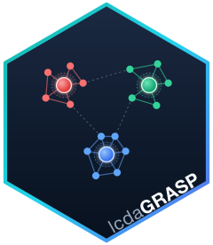

# lcdaGRASP 

<!-- badges: start -->
[](https://github.com/castlaboratory/lcdaGRASP/actions/workflows/R-CMD-check.yaml)
[](https://github.com/castlaboratory/lcdaGRASP/actions/workflows/pkgdown.yaml)
[](https://github.com/castlaboratory/lcdaGRASP/actions/workflows/test-coverage.yaml)
[](https://app.codecov.io/gh/castlaboratory/lcdaGRASP)
[](https://github.com/castlaboratory/lcdaGRASP/actions/workflows/lint.yaml)
<!-- badges: end -->

**lcdaGRASP** implements GRASP and Reactive GRASP algorithms for **joint
community-and-leader detection** in complex networks, with performance-critical
kernels in C++ via Rcpp. It accompanies:

> Ospina, R., Silva, G., Matos Junior, F. J., Leite, A., & Ochi, L. S. (2026).
> *A GRASP Framework for Community and Leader Detection in Complex Networks.*

The package provides the four core algorithms (LCDA-GRASP 1/2 and LCDA-GR 1/2),
the ensemble-consensus variant **LCDA-ECG**, the Node-Connection Entropy (NCE)
leader score (global and community-conditioned), and non-parametric comparison
utilities (Kruskal–Wallis + pairwise permutation). Vignettes render a
publication-grade simulation panel (benchmarks, a George-Box
design-of-experiments study, LFR robustness, reactive convergence, degeneracy,
EDA, leader scores) from precomputed data, so they build without re-running any
simulation.

Package website (pkgdown): **https://castlaboratory.github.io/lcdaGRASP/**

## Install

```r
# from GitHub
remotes::install_github("castlaboratory/lcdaGRASP")
```

(CRAN submission is in progress.)

## Quick start

```r
library(lcdaGRASP)
library(igraph)

g   <- make_graph("Zachary")
res <- lcda_grasp(g, alpha_c = 0.1, alpha_s = 0.3, B = 50, seed = 1, verbose = TRUE)
print(res)

res_r <- lcda_gr(g, variant = 1, B = 150, seed = 1)   # Reactive, self-tuning
print(res_r)

res_e <- lcda_ecg(g, B = 64, seed = 1)                # ensemble consensus
print(res_e)
```

Precomputed simulation results back the articles and are listed with
`lcda_data()`; load one with `lcda_data("repro_summary")`.

## Articles

| Article | What it shows |
|---|---|
| Getting started | API tour |
| Benchmark reproduction | Reproduces the benchmark modularity; a multi-restart Louvain/Leiden reaches the exact optimum (0.4198) on Karate |
| Ensemble consensus (LCDA-ECG) | Consensus over the GRASP pool: recovery, overlap, node confidence |
| **DoE parameter tuning** | Factorial screening → response surface (CCD) → canonical optimum for `(α_c, α_s)` |
| Robustness (LFR) | Q **and** ARI across the mixing sweep |
| Reactive convergence | Proposition 6 empirically (entropy decay) |
| Pool sensitivity | `(m, y, B)` grid + lex-decisive audit |
| Modularity degeneracy | Near-best partition counts + NMI |
| EDA distributions | Boxplots / ECDFs / (Q, H) scatter |
| Leader score | Global vs community-conditioned NCE |

## Rebuild the data and the site

```bash
Rscript data-raw/run_all_data.R              # regenerate inst/extdata/*.rds (slow, once)
Rscript -e 'pkgdown::build_site(".")'        # build docs/
```

## License

MIT. See `LICENSE`.
