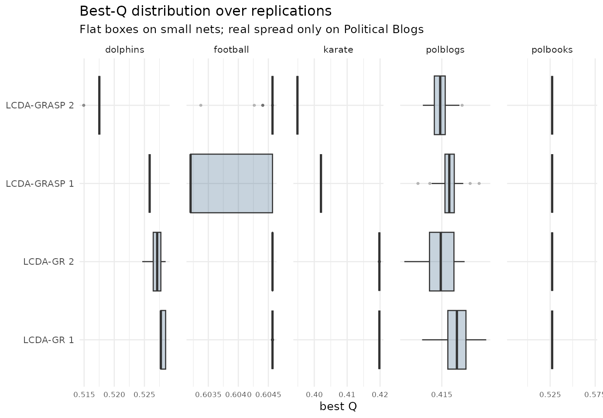

# Reproducing the paper's benchmark numbers

## What this article shows

The paper reports only **means** and **maxima**. Here we reproduce its
headline modularity numbers on the five benchmark networks while keeping
the **whole distribution** over replications, and we compare against
`igraph`’s Louvain *and* Leiden under a like-for-like multi-restart
protocol.

**Source.** Newman netdata collection (websites.umich.edu/~mejn) +
igraph::make_graph(‘Zachary’)

**Generated.** 2026-05-28 with lcdaGRASP 0.2.0, R version 4.6.0
(2026-04-24) (seed 20260527, 30 reps).

**Limitations.**

- alpha_c/alpha_s use package defaults (0.1, 0.3), not the paper’s exact
  RCL parameters.
- PolBlogs collapsed directed-\>undirected keeping all 1490 nodes (giant
  component = 1222).
- Reference Q are literature best-known; only Karate is a certified
  optimum.

## Best modularity vs baselines and literature

``` r

res <- summ$results
best <- res |>
  dplyr::group_by(network) |>
  dplyr::slice_max(Q_max, n = 1, with_ties = FALSE) |>
  dplyr::ungroup() |>
  dplyr::transmute(
    network,
    best_algo = algo,
    Q_best = round(Q_max, 4),
    Louvain_max = round(Q_louvain_max, 4),
    Leiden_max  = round(Q_leiden_max, 4),
    Q_literature = round(Q_ref, 4),
    kind
  )
knitr::kable(best, caption = "Best LCDA Q over reps vs multi-restart Louvain/Leiden and literature best-known Q.")
```

| network  | best_algo    | Q_best | Louvain_max | Leiden_max | Q_literature | kind          |
|:---------|:-------------|-------:|------------:|-----------:|-------------:|:--------------|
| dolphins | LCDA-GR 1    | 0.5285 |      0.5277 |     0.5285 |       0.5285 | best known    |
| football | LCDA-GR 1    | 0.6046 |      0.6046 |     0.6046 |       0.6046 | best known    |
| karate   | LCDA-GR 1    | 0.4198 |      0.4198 |     0.4198 |       0.4198 | exact optimum |
| polblogs | LCDA-GRASP 1 | 0.4184 |      0.4271 |     0.4271 |       0.4271 | best known    |
| polbooks | LCDA-GR 1    | 0.5272 |      0.5271 |     0.5272 |       0.5272 | best known    |

Best LCDA Q over reps vs multi-restart Louvain/Leiden and literature
best-known Q. {.table}

## Louvain on Karate reaches the optimum under multi-restart

A *single-run* Louvain can report `Q ≈ 0.3715` on Karate, which would
suggest a large advantage for any competing method. But this is an
artefact of the single run: with 30 restarts the current `igraph`
Louvain reaches the exact optimum, so a like-for-like comparison tells a
different story:

``` r

res |>
  dplyr::filter(network == "karate") |>
  dplyr::summarise(
    LCDA_best   = round(max(Q_max), 4),
    Louvain_max = round(dplyr::first(Q_louvain_max), 4),
    Leiden_max  = round(dplyr::first(Q_leiden_max), 4),
    single_run_Louvain = 0.3715,
    exact_optimum = 0.4198
  ) |>
  knitr::kable(caption = "Karate: an apparent advantage over Louvain is an artefact of a single-run baseline.")
```

| LCDA_best | Louvain_max | Leiden_max | single_run_Louvain | exact_optimum |
|----------:|------------:|-----------:|-------------------:|--------------:|
|    0.4198 |      0.4198 |     0.4198 |             0.3715 |        0.4198 |

Karate: an apparent advantage over Louvain is an artefact of a
single-run baseline. {.table}

So on Karate the proposed methods **match** a properly tuned
Louvain/Leiden rather than beating it.

## Distribution of Q across replications

Means alone hide that the advertised diversification produces a
*degenerate* Q distribution on the small networks (sd ~ 0) and only
spreads on the one large/diffuse network, Political Blogs.

``` r

library(ggplot2)
ggplot(bench$results, aes(algo, Q)) +
  geom_boxplot(outlier.size = 0.6, fill = "#1f4e79", alpha = 0.25) +
  facet_wrap(~ network, scales = "free_y") +
  coord_flip() +
  labs(title = "Best-Q distribution over replications",
       subtitle = "Flat boxes on small nets; real spread only on Political Blogs",
       x = NULL, y = "best Q") +
  theme_minimal(base_size = 10)
```



``` r

bench$results |>
  dplyr::filter(network == "polblogs") |>
  dplyr::group_by(algo) |>
  dplyr::summarise(Q_mean = round(mean(Q), 4), Q_sd = round(sd(Q), 4),
                   Q_max = round(max(Q), 4), .groups = "drop") |>
  knitr::kable(caption = "Political Blogs: all four variants trail the best baseline by ~2%.")
```

| algo         | Q_mean |   Q_sd |  Q_max |
|:-------------|-------:|-------:|-------:|
| LCDA-GR 1    | 0.4159 | 0.0017 | 0.4179 |
| LCDA-GR 2    | 0.4152 | 0.0013 | 0.4173 |
| LCDA-GRASP 1 | 0.4156 | 0.0011 | 0.4184 |
| LCDA-GRASP 2 | 0.4149 | 0.0009 | 0.4168 |

Political Blogs: all four variants trail the best baseline by ~2%.
{.table}

## Takeaways

1.  **LCDA-GR reproduces “match best known”** on the four small
    networks.
2.  **Multi-restart matters**: Louvain on Karate reaches 0.4198 (the
    optimum) over 30 restarts, so single-run baselines overstate any
    advantage.
3.  **Coverage gap**: on the only large network the methods trail
    Louvain/Leiden by ~2% — the advantage is benchmark-dependent.

## References

- Blondel, V. D., Guillaume, J.-L., Lambiotte, R., & Lefebvre, E.
  (2008). Fast unfolding of communities in large networks. *J. Stat.
  Mech.*, P10008.
  [doi:10.1088/1742-5468/2008/10/P10008](https://doi.org/10.1088/1742-5468/2008/10/P10008)
- Traag, V. A., Waltman, L., & van Eck, N. J. (2019). From Louvain to
  Leiden. *Scientific Reports*, 9, 5233.
  [doi:10.1038/s41598-019-41695-z](https://doi.org/10.1038/s41598-019-41695-z)
- Newman, M. E. J., & Girvan, M. (2004). Finding and evaluating
  community structure in networks. *Phys. Rev. E*, 69, 026113.
  [doi:10.1103/PhysRevE.69.026113](https://doi.org/10.1103/PhysRevE.69.026113)
