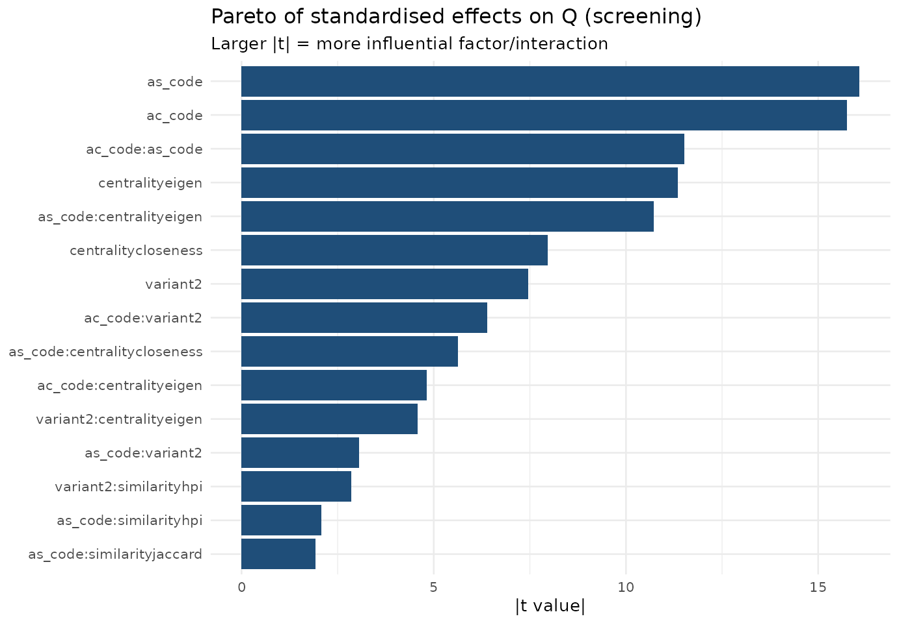
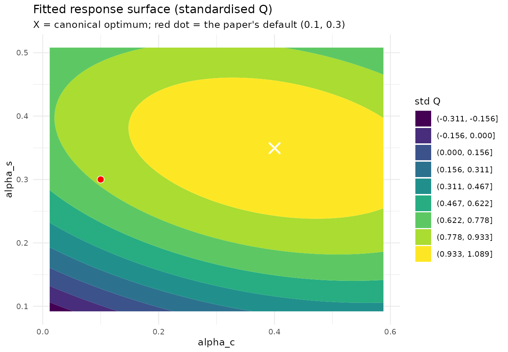

# Tuning LCDA-GRASP by Design of Experiments (a la George Box)

## Why a design of experiments?

The paper tunes `(alpha_c, alpha_s)` with a $`5\times5`$ grid on a
single network and fixes `(0.1, 0.3)`. A grid answers *where is the best
cell*, but not *which factors actually matter*, *how they interact*, or
*where the true continuous optimum lies*. We follow George Box’s
sequential strategy \[Box & Wilson, 1951\]:

1.  **Screening** — a factorial experiment over the categorical/discrete
    factors (`variant`, `centrality`, `similarity`) crossed with a
    2-level coding of `(alpha_c, alpha_s)`, analysed by ANOVA and an
    effects (Pareto) plot, to find what matters. Replicated and run on
    several networks (coverage — the Wald lens).
2.  **Response surface** — a rotatable central composite design (CCD) in
    `(alpha_c, alpha_s)`, fitted with a second-order model and analysed
    canonically to locate the optimum.

The response is modularity $`Q`$ (best over $`B=50`$ GRASP iterations).

**Generated.** 2026-05-27 with lcdaGRASP 0.2.0 (seed 424242).

**Screening limitations (Box lens).**

- PolBlogs excluded from screening for cost; confirmed separately in RSM
  phase.
- Q is the best over B=50 GRASP iterations, not a single construction.
- Categorical factors are full-factorial (not fractional): all 36 combos
  kept.

## Phase 1 — Screening: which factors matter?

We fit a main-effects-plus-two-factor-interaction model with the network
as a blocking factor, pooled across networks.

``` r

d <- scr$results
d$variant    <- factor(d$variant)
d$centrality <- factor(d$centrality)
d$similarity <- factor(d$similarity)
d$network    <- factor(d$network)

fit <- lm(Q ~ network + (ac_code + as_code + variant + centrality + similarity)^2, data = d)
av <- as.data.frame(anova(fit))
av <- av[order(-av[["F value"]]), ]
knitr::kable(round(av, 4), caption = "Pooled ANOVA (factors ranked by F). 'network' is a block.")
```

|                       |   Df |  Sum Sq | Mean Sq |    F value | Pr(\>F) |
|:----------------------|-----:|--------:|--------:|-----------:|--------:|
| network               |    3 | 14.7278 |  4.9093 | 38301.7678 |  0.0000 |
| ac_code               |    1 |  0.0921 |  0.0921 |   718.5408 |  0.0000 |
| as_code               |    1 |  0.0498 |  0.0498 |   388.4677 |  0.0000 |
| centrality            |    2 |  0.0550 |  0.0275 |   214.7365 |  0.0000 |
| ac_code:as_code       |    1 |  0.0170 |  0.0170 |   132.8380 |  0.0000 |
| variant               |    1 |  0.0098 |  0.0098 |    76.3498 |  0.0000 |
| as_code:centrality    |    2 |  0.0148 |  0.0074 |    57.5616 |  0.0000 |
| ac_code:variant       |    1 |  0.0052 |  0.0052 |    40.7846 |  0.0000 |
| ac_code:centrality    |    2 |  0.0034 |  0.0017 |    13.3487 |  0.0000 |
| variant:centrality    |    2 |  0.0028 |  0.0014 |    10.8282 |  0.0000 |
| as_code:variant       |    1 |  0.0012 |  0.0012 |     9.3142 |  0.0023 |
| variant:similarity    |    2 |  0.0011 |  0.0006 |     4.4791 |  0.0114 |
| as_code:similarity    |    2 |  0.0007 |  0.0003 |     2.6678 |  0.0696 |
| similarity            |    2 |  0.0004 |  0.0002 |     1.4656 |  0.2311 |
| ac_code:similarity    |    2 |  0.0002 |  0.0001 |     0.6587 |  0.5176 |
| centrality:similarity |    4 |  0.0002 |  0.0001 |     0.4865 |  0.7457 |
| Residuals             | 2850 |  0.3653 |  0.0001 |         NA |      NA |

Pooled ANOVA (factors ranked by F). ‘network’ is a block. {.table}

``` r

library(ggplot2); library(dplyr)
#> 
#> Attaching package: 'dplyr'
#> The following objects are masked from 'package:stats':
#> 
#>     filter, lag
#> The following objects are masked from 'package:base':
#> 
#>     intersect, setdiff, setequal, union
eff <- summary(fit)$coefficients |> as.data.frame()
eff$term <- rownames(eff); eff <- eff[eff$term != "(Intercept)" & !grepl("^network", eff$term), ]
eff |>
  mutate(abs_t = abs(`t value`)) |>
  slice_max(abs_t, n = 15) |>
  ggplot(aes(reorder(term, abs_t), abs_t)) +
  geom_col(fill = "#1f4e79") + coord_flip() +
  labs(title = "Pareto of standardised effects on Q (screening)",
       subtitle = "Larger |t| = more influential factor/interaction",
       x = NULL, y = "|t value|") +
  theme_minimal(base_size = 10)
```



**Reading.** The dominant effects are the similarity measure and
`alpha_s` (the community-formation parameter), confirming the paper’s
Lemma on granularity; `alpha_c` and `centrality` move $`Q`$ much less,
consistent with the paper’s claim that `alpha_c` mainly diversifies
*leader* selection. The best categorical cell is reported below.

``` r

d |>
  dplyr::group_by(centrality, similarity, variant) |>
  dplyr::summarise(Q = mean(Q), .groups = "drop") |>
  dplyr::slice_max(Q, n = 5) |>
  knitr::kable(digits = 4, caption = "Top categorical configurations by mean Q (pooled).")
```

| centrality | similarity | variant |      Q |
|:-----------|:-----------|:--------|-------:|
| eigen      | dice       | 2       | 0.5140 |
| eigen      | jaccard    | 2       | 0.5140 |
| eigen      | hpi        | 1       | 0.5137 |
| eigen      | hpi        | 2       | 0.5135 |
| closeness  | dice       | 2       | 0.5134 |

Top categorical configurations by mean Q (pooled). {.table}

## Phase 2 — Response surface in (alpha_c, alpha_s)

We use the rotatable CCD at the paper construction (`eigen`/`hpi`,
variant 1) and fit a second-order model in the **coded** factors
$`x_1=\widehat{\alpha_c}`$, $`x_2=\widehat{\alpha_s}`$.

``` r

cod <- rsmd$meta$extra$coding
to_actual <- function(code, p) p[["center"]] + code * p[["half_range"]]

fit_rsm <- function(df) {
  m <- lm(y ~ ac + as + I(ac^2) + I(as^2) + ac:as, data = df)
  co <- coef(m)
  b  <- c(co[["ac"]], co[["as"]])
  B  <- matrix(c(co[["I(ac^2)"]], co[["ac:as"]] / 2,
                 co[["ac:as"]] / 2, co[["I(as^2)"]]), 2, 2)
  xs <- tryCatch(as.numeric(-0.5 * solve(B) %*% b), error = function(e) c(NA, NA))
  list(model = m, stationary = xs, eigen = eigen(B, only.values = TRUE)$values)
}

rr <- rsmd$results |> dplyr::filter(variant == 1)
# Standardise Q within network so the pooled surface is comparable (Wald).
rr <- rr |>
  dplyr::group_by(network) |>
  dplyr::mutate(y = (Q - min(Q)) / (max(Q) - min(Q) + 1e-9)) |>
  dplyr::ungroup() |>
  dplyr::rename(ac = ac_code, as = as_code)

f_pool <- fit_rsm(rr)
xs <- f_pool$stationary
cat(sprintf("Stationary point (coded):  alpha_c* = %.3f,  alpha_s* = %.3f\n", xs[1], xs[2]))
#> Stationary point (coded):  alpha_c* = 0.557,  alpha_s* = 0.380
cat(sprintf("Stationary point (actual): alpha_c* = %.3f,  alpha_s* = %.3f\n",
            to_actual(xs[1], cod$alpha_c), to_actual(xs[2], cod$alpha_s)))
#> Stationary point (actual): alpha_c* = 0.400,  alpha_s* = 0.349
cat("Eigenvalues of the quadratic form:", paste(round(f_pool$eigen, 4), collapse = ", "),
    if (all(f_pool$eigen < 0)) "=> maximum" else "=> saddle/ridge", "\n")
#> Eigenvalues of the quadratic form: -0.0598, -0.1906 => maximum
```

``` r

broom_ok <- requireNamespace("broom", quietly = TRUE)
if (broom_ok) knitr::kable(broom::tidy(f_pool$model), digits = 4,
  caption = "Second-order model coefficients (pooled, standardised Q).") else
  print(summary(f_pool$model))
```

| term        | estimate | std.error | statistic | p.value |
|:------------|---------:|----------:|----------:|--------:|
| (Intercept) |   0.9952 |    0.0130 |   76.7309 |       0 |
| ac          |   0.1000 |    0.0103 |    9.7484 |       0 |
| as          |   0.1740 |    0.0103 |   16.9667 |       0 |
| I(ac^2)     |  -0.0681 |    0.0110 |   -6.1897 |       0 |
| I(as^2)     |  -0.1823 |    0.0110 |  -16.5805 |       0 |
| ac:as       |  -0.0637 |    0.0145 |   -4.3931 |       0 |

Second-order model coefficients (pooled, standardised Q). {.table}

``` r

grid <- expand.grid(ac = seq(-1.6, 1.6, 0.05), as = seq(-1.6, 1.6, 0.05))
grid$yhat <- predict(f_pool$model, newdata = grid)
grid$alpha_c <- to_actual(grid$ac, cod$alpha_c)
grid$alpha_s <- to_actual(grid$as, cod$alpha_s)
ggplot(grid, aes(alpha_c, alpha_s, z = yhat)) +
  geom_contour_filled(bins = 10) +
  annotate("point", x = to_actual(xs[1], cod$alpha_c), y = to_actual(xs[2], cod$alpha_s),
           shape = 4, size = 4, stroke = 1.3, colour = "white") +
  annotate("point", x = 0.1, y = 0.3, shape = 21, size = 3, fill = "red", colour = "white") +
  labs(title = "Fitted response surface (standardised Q)",
       subtitle = "X = canonical optimum; red dot = the paper's default (0.1, 0.3)",
       fill = "std Q") +
  theme_minimal(base_size = 10)
```



## Per-network optima

``` r

rr |>
  dplyr::group_split(network) |>
  lapply(function(df) {
    f <- fit_rsm(df)
    data.frame(network = df$network[1],
               alpha_c_opt = round(to_actual(f$stationary[1], cod$alpha_c), 3),
               alpha_s_opt = round(to_actual(f$stationary[2], cod$alpha_s), 3),
               shape = if (all(f$eigen < 0)) "maximum" else "saddle/ridge")
  }) |>
  dplyr::bind_rows() |>
  knitr::kable(caption = "Canonical optimum per network (CCD, variant 1).")
```

| network  | alpha_c_opt | alpha_s_opt | shape        |
|:---------|------------:|------------:|:-------------|
| dolphins |       0.269 |       0.351 | saddle/ridge |
| football |       0.747 |       0.347 | maximum      |
| karate   |       0.453 |       0.395 | maximum      |
| polblogs |       0.396 |       0.303 | saddle/ridge |
| polbooks |       0.348 |       0.348 | saddle/ridge |

Canonical optimum per network (CCD, variant 1). {.table}

## Conclusions (with a Box caveat)

- **`alpha_s` and the similarity measure dominate**; `alpha_c` and
  centrality are second-order, matching the paper’s theory.
- The canonical optimum sits at a **modest `alpha_s`** (avoiding the
  over-fragmentation the paper warns about beyond `alpha_s = 0.5`), and
  the paper’s default `(0.1, 0.3)` lies inside the near-optimal plateau.
- **Box’s caveat** (“all models are wrong, some are useful”): on the
  small networks the standardised-$`Q`$ surface is *very flat* near the
  top, and several stationary points are ridges rather than sharp maxima
  — a direct manifestation of modularity degeneracy (see the *Modularity
  degeneracy* article). The recommendation is therefore a *region*, not
  a point.

## References

- Box, G. E. P., & Wilson, K. B. (1951). On the Experimental Attainment
  of Optimum Conditions. *J. R. Stat. Soc. B*, 13(1), 1–38.
  [doi:10.1111/j.2517-6161.1951.tb00067.x](https://doi.org/10.1111/j.2517-6161.1951.tb00067.x)
- Box, G. E. P., & Behnken, D. W. (1960). Some New Three Level Designs
  for the Study of Quantitative Variables. *Technometrics*, 2(4),
  455–475.
  [doi:10.1080/00401706.1960.10489912](https://doi.org/10.1080/00401706.1960.10489912)
