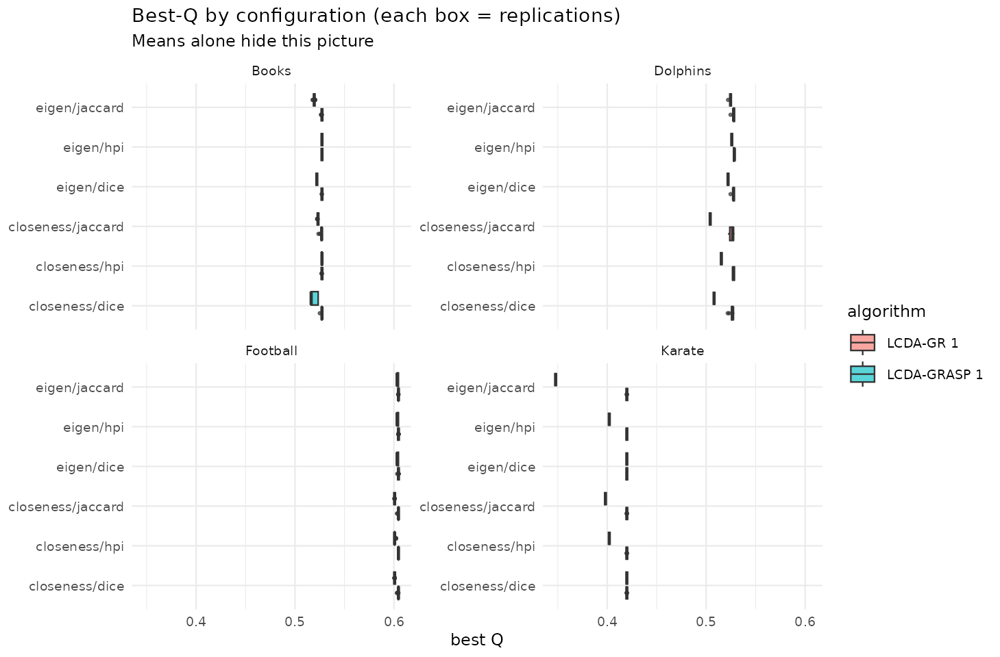
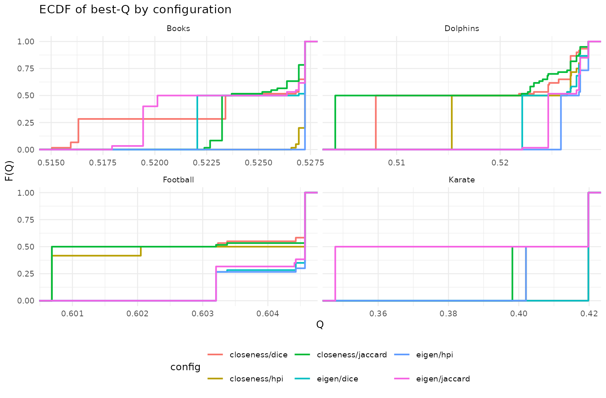
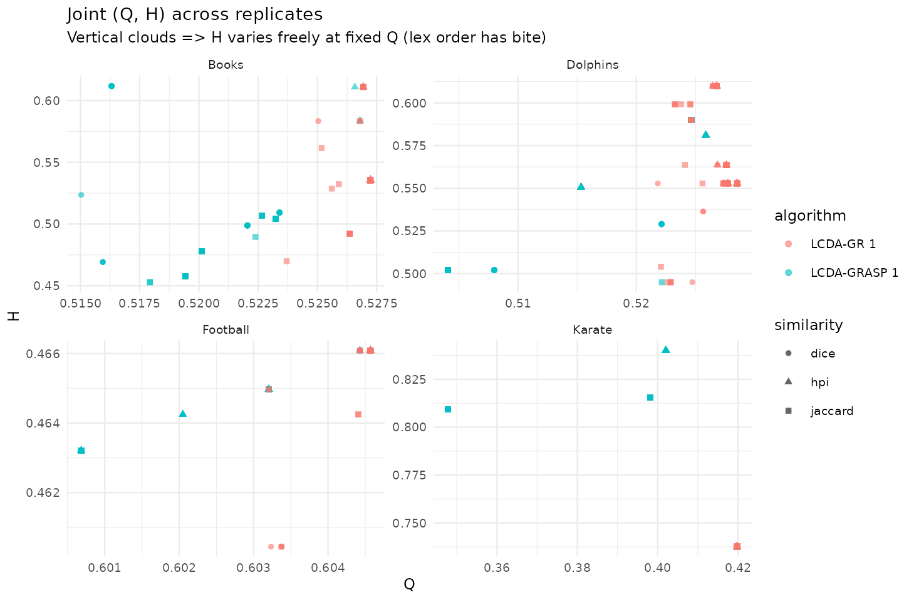

# Exploratory distributions of Q and H (Tukey)

## Show the distribution, not just the mean

Tukey’s lens privileges exploratory analysis. The paper reports means
and significance letters; here we draw the **boxplots, ECDFs and (Q, H)
scatter** that those tables hide, over replications per (graph
$`\times`$ algorithm $`\times`$ centrality $`\times`$ similarity).

``` r

library(ggplot2); library(dplyr)
#> 
#> Attaching package: 'dplyr'
#> The following objects are masked from 'package:stats':
#> 
#>     filter, lag
#> The following objects are masked from 'package:base':
#> 
#>     intersect, setdiff, setequal, union
res <- d$results |> mutate(config = paste(centrality, similarity, sep = "/"))
```

``` r

ggplot(res, aes(config, Q, fill = algorithm)) +
  geom_boxplot(outlier.size = 0.5, alpha = 0.65) +
  facet_wrap(~ graph, scales = "free_y") + coord_flip() +
  labs(title = "Best-Q by configuration (each box = replications)",
       subtitle = "Means alone hide this picture", x = NULL, y = "best Q") +
  theme_minimal(base_size = 9)
```



``` r

ggplot(res, aes(Q, colour = config)) +
  stat_ecdf(geom = "step", linewidth = 0.7) +
  facet_wrap(~ graph, scales = "free_x") +
  labs(title = "ECDF of best-Q by configuration", x = "Q", y = "F(Q)") +
  theme_minimal(base_size = 9) + theme(legend.position = "bottom")
```



``` r

ggplot(res, aes(Q, H, colour = algorithm, shape = similarity)) +
  geom_point(alpha = 0.6, size = 1.4) +
  facet_wrap(~ graph, scales = "free") +
  labs(title = "Joint (Q, H) across replicates",
       subtitle = "Vertical clouds => H varies freely at fixed Q (lex order has bite)") +
  theme_minimal(base_size = 9)
```



``` r

d$results |>
  dplyr::group_by(graph, centrality, similarity) |>
  dplyr::summarise(Q = mean(Q), .groups = "drop_last") |>
  dplyr::slice_max(Q, n = 1) |>
  dplyr::ungroup() |>
  knitr::kable(digits = 4, caption = "Best centrality/similarity per network (mean Q).")
```

| graph    | centrality | similarity |      Q |
|:---------|:-----------|:-----------|-------:|
| Books    | closeness  | hpi        | 0.5272 |
| Books    | eigen      | hpi        | 0.5272 |
| Dolphins | closeness  | hpi        | 0.5214 |
| Dolphins | eigen      | hpi        | 0.5270 |
| Football | closeness  | hpi        | 0.6027 |
| Football | eigen      | hpi        | 0.6042 |
| Karate   | closeness  | dice       | 0.4198 |
| Karate   | eigen      | dice       | 0.4198 |

Best centrality/similarity per network (mean Q). {.table}

**Reading.** HPI + eigenvector is the modal winner, matching the paper’s
recommendation — but the boxplots show the margins are often within
noise, and the (Q, H) clouds are nearly vertical, i.e. $`H`$ varies at
essentially fixed $`Q`$. That is exactly the situation in which a
lexicographic (Q, then H) objective could in principle bite; whether it
actually does is quantified in the *Pool sensitivity* article (it rarely
does).

## References

- Newman, M. E. J., & Girvan, M. (2004). Finding and evaluating
  community structure in networks. *Phys. Rev. E*, 69, 026113.
  [doi:10.1103/PhysRevE.69.026113](https://doi.org/10.1103/PhysRevE.69.026113)
