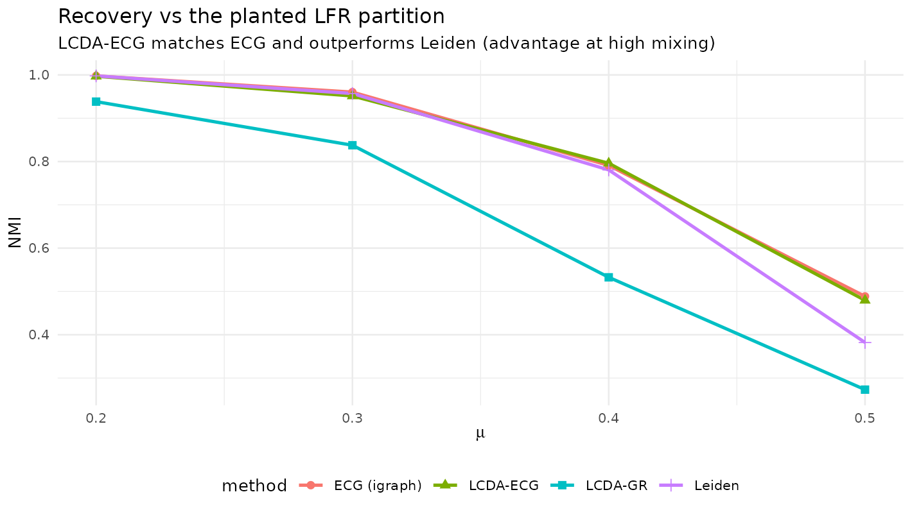
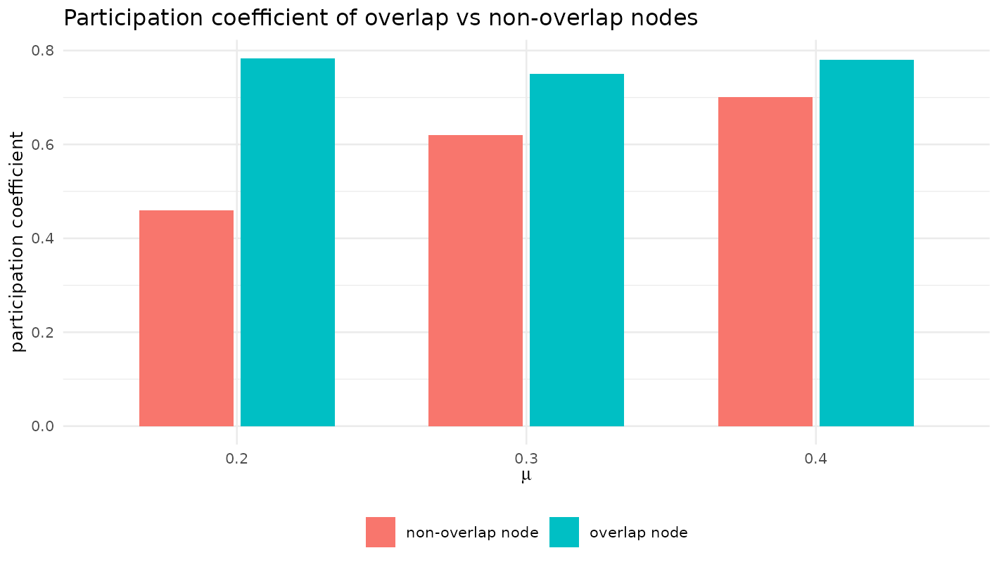
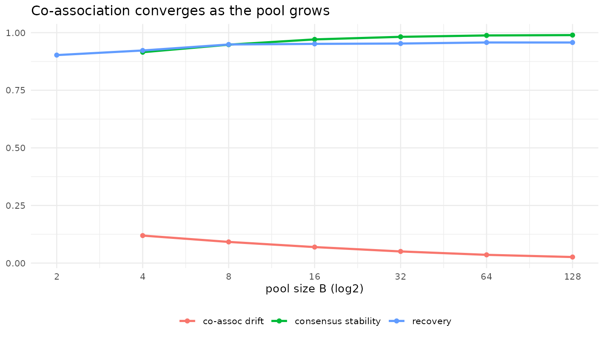

# Ensemble consensus over the GRASP pool (LCDA-ECG)

## Why throw the pool away?

A multi-start search produces a whole **pool** of diverse partitions,
yet the GRASP/Reactive variants keep only the single best-by-$`(Q,H)`$
solution. Following Ensemble Clustering for Graphs (Poulin & Théberge,
2019),
[`lcda_ecg()`](https://castlaboratory.github.io/lcdaGRASP/reference/lcda_ecg.md)
instead aggregates the pool: the fraction of pool partitions in which
two endpoints share a community becomes an edge **co-association**
weight, and the reweighted graph is re-clustered for a **consensus
partition**. Three by-products come for free: a consensus leader, a
node-confidence map, and overlapping communities.

``` r

g <- igraph::make_graph("Zachary")
res <- lcda_ecg(g, B = 32, overlap = TRUE, tau = 0.6, seed = 1)
res
#> 
#> ── LCDA-ECG (ensemble consensus) result ────────────────────────────────────────
#> communities: 4
#> modularity Q (input): 0.41979
#> Q (consensus weights): 0.588951
#> pool size B: 32
#> mean node confidence: 0.83
#> overlap nodes: 6 (tau = 0.6)
cat("consensus leaders:", res$leaders, "\n")
#> consensus leaders: 1 6 34 25
cat("overlap (bridge) nodes:", which(res$is_overlap), "\n")
#> overlap (bridge) nodes: 1 5 6 7 10 11
```

## Consensus closes the recovery gap

``` r

library(ggplot2); library(dplyr)
#> 
#> Attaching package: 'dplyr'
#> The following objects are masked from 'package:stats':
#> 
#>     filter, lag
#> The following objects are masked from 'package:base':
#> 
#>     intersect, setdiff, setequal, union
rec$results$summary |>
  ggplot(aes(mu, NMI, colour = method, shape = method)) +
  geom_line(linewidth = 0.9) + geom_point(size = 2) +
  labs(title = "Recovery vs the planted LFR partition",
       subtitle = "LCDA-ECG matches ECG and outperforms Leiden (advantage at high mixing)",
       x = expression(mu), y = "NMI") +
  theme_minimal(base_size = 10) + theme(legend.position = "bottom")
```



The fixed/Reactive variants trail Leiden and ECG on recovery; the
ensemble-consensus variant **LCDA-ECG** matches ECG and overtakes Leiden
in the high-mixing regime, where consensus is most valuable. (It stays
on par with ECG rather than beating it.)

## Overlapping nodes show bridge-like connectivity

``` r

ov$results$per_graph |>
  group_by(mu) |>
  summarise(`overlap node` = mean(P_overlap, na.rm = TRUE),
            `non-overlap node` = mean(P_nonoverlap, na.rm = TRUE), .groups = "drop") |>
  tidyr::pivot_longer(-mu, names_to = "kind", values_to = "P") |>
  ggplot(aes(factor(mu), P, fill = kind)) +
  geom_col(position = position_dodge(0.7), width = 0.65) +
  labs(title = "Participation coefficient of overlap vs non-overlap nodes",
       x = expression(mu), y = "participation coefficient", fill = NULL) +
  theme_minimal(base_size = 10) + theme(legend.position = "bottom")
```



Nodes that LCDA-ECG places in more than one community have a
significantly higher participation coefficient (their edges spread
across communities), i.e. bridge-like connectivity. Because both the
participation coefficient and the overlap-assignment rule read the same
node-to-community edge distribution, this is a consistency check rather
than an independent validation.

## The pool stabilises (so the pool size is principled)

``` r

st$results |>
  group_by(B) |>
  summarise(`co-assoc drift` = mean(coassoc_drift, na.rm = TRUE),
            `consensus stability` = mean(consensus_stability, na.rm = TRUE),
            `recovery` = mean(recovery), .groups = "drop") |>
  tidyr::pivot_longer(-B, names_to = "metric", values_to = "value") |>
  ggplot(aes(B, value, colour = metric)) +
  geom_line(linewidth = 0.9) + geom_point(size = 1.5) +
  scale_x_continuous(trans = "log2", breaks = c(2, 4, 8, 16, 32, 64, 128)) +
  labs(title = "Co-association converges as the pool grows",
       x = "pool size B (log2)", y = NULL, colour = NULL) +
  theme_minimal(base_size = 10) + theme(legend.position = "bottom")
#> Warning: Removed 2 rows containing missing values or values outside the scale range
#> (`geom_line()`).
#> Warning: Removed 2 rows containing missing values or values outside the scale range
#> (`geom_point()`).
```



As $`B`$ grows the co-association drift vanishes and both the consensus
partition and its recovery plateau by $`B\approx 32`$ — a
stability-based stopping rule, consistent with the asymptotic
concentration of the Reactive update.

## References

- Poulin, V., & Théberge, F. (2019). Ensemble clustering for graphs.
  *Applied Network Science*, 4, 51.
  [doi:10.1007/s41109-019-0162-z](https://doi.org/10.1007/s41109-019-0162-z)
