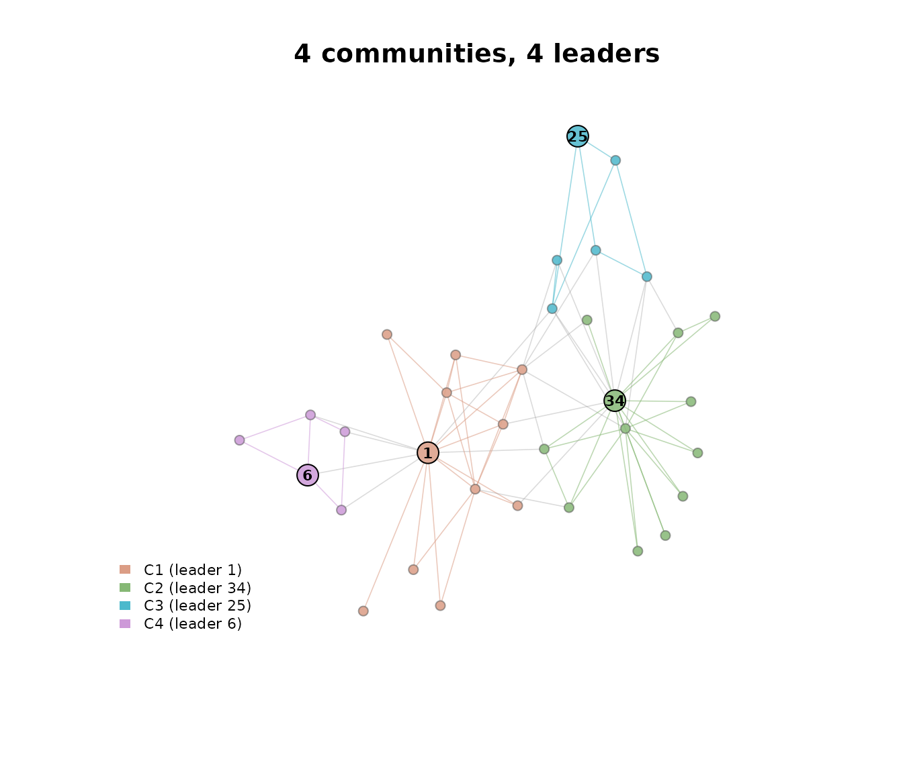

# Getting started with lcdaGRASP

## Overview

`lcdaGRASP` implements the four algorithms of Ospina, Silva, Matos
Junior, Leite and Ochi (2026) for **joint community-and-leader
detection**:

- [`lcda_grasp()`](https://castlaboratory.github.io/lcdaGRASP/reference/lcda_grasp.md)
  — fixed-parameter GRASP, variants 1 (static centrality) and 2
  (adaptive centrality recomputed each iteration).
- [`lcda_gr()`](https://castlaboratory.github.io/lcdaGRASP/reference/lcda_gr.md)
  — Reactive GRASP, variants 1 and 2, with a bivariate self-tuning
  mechanism over a pool of `(alpha_c, alpha_s)` pairs.

The performance-critical kernels (incremental modularity, community
affinities, similarity vectors, the VNMI multi-improvement extension,
and power-iteration eigenvector centrality) are implemented in C++ via
Rcpp. The package follows a tidyverse style: snake_case throughout,
`tibble` outputs where tabular, `cli` for logging, and a `verbose` flag
on every substantive function.

## Quick start

``` r

library(lcdaGRASP)
#> lcdaGRASP 0.3.2 - GRASP / Reactive-GRASP for joint community-leader detection.
#> Reference: Ospina et al. (2026), preprint. See `vignette('lcdaGRASP-intro')`.
library(igraph)
#> 
#> Attaching package: 'igraph'
#> The following objects are masked from 'package:stats':
#> 
#>     decompose, spectrum
#> The following object is masked from 'package:base':
#> 
#>     union

g <- make_graph("Zachary")           # 34-node karate club
res <- lcda_grasp(g,
                  alpha_c = 0.1, alpha_s = 0.3, B = 30,
                  centrality = "eigen", similarity = "hpi",
                  seed = 1)
print(res)
#> 
#> ── LCDA-GRASP result ───────────────────────────────────────────────────────────
#> variant: 1
#> B: 30
#> centrality / similarity: eigen / hpi
#> best Q: 0.402038
#> best H: 0.84
#> best iteration: 4
#> communities: 3
#> elapsed (s): 0.204
#> ℹ `lcda_metrics()` for the full metric table; `plot()` for the community-leader map.
```

Set `verbose = TRUE` for a `cli` progress bar and a one-line summary:

``` r

invisible(lcda_grasp(g, B = 10, seed = 1, verbose = TRUE))
#> ✔ best Q = 0.402038 (H = 0.84) at iteration 4, 3 communities
```

## Inspecting the GRASP trajectory

``` r

plot_grasp_trajectory(res)
```


## Switching to the Reactive variant

``` r

res_r <- lcda_gr(g, variant = 1, B = 100, seed = 1)
print(res_r)
#> 
#> ── LCDA-GR (Reactive) result ───────────────────────────────────────────────────
#> variant: 1
#> B / m / y: 100 / 20 / 60
#> best Q: 0.41979
#> best H: 0.7377
#> best iter / pair: 5 / 17
#> H-decisive updates: 0 (0.0% of B)
#> elapsed (s): 0.939
#> ℹ `lcda_metrics()` for the full metric table; `plot()` for the community-leader map.
plot_reactive_pk(res_r)
```


The print method reports the fraction of iterations in which the
lexicographic tie-break on `H` (Node-Connection Entropy) was decisive —
iterations where `Q` was tied with the running best and `H` made the
difference. In typical networks this fraction is small; see the
*Reactive convergence* and *Pool sensitivity* articles.

## Statistical comparison

The paper uses a Kruskal–Wallis omnibus test followed by pairwise
permutation tests with Bonferroni correction.
[`kruskal_then_permute()`](https://castlaboratory.github.io/lcdaGRASP/reference/kruskal_then_permute.md)
returns a tibble of pairwise contrasts and a compact-letter display:

``` r

set.seed(1)
df <- data.frame(
  Q = c(rnorm(20, 0.40, 0.01), rnorm(20, 0.42, 0.01), rnorm(20, 0.42, 0.01)),
  cfg = rep(c("a", "b", "c"), each = 20)
)
out <- kruskal_then_permute(df$Q, df$cfg, B_perm = 2000)
out$letters
#>   a   b   c 
#> "a" "b" "b"
```

## From a result to the paper’s numbers

[`lcda_metrics()`](https://castlaboratory.github.io/lcdaGRASP/reference/lcda_metrics.md)
turns a fitted result into the quantities the paper’s tables report. The
default level is a tidy long table grouped by *scope*: the partition (Q,
community count, size distribution), the leaders (the NCE score in both
forms, leader degrees, coverage), the search (runtime, the best
iteration, trace dispersion, and how often the lexicographic tie-break
on `H` was actually decisive), and — when a ground truth is supplied —
recovery.

``` r

m <- lcda_metrics(res_r)
subset(m, scope %in% c("partition", "search"))
#> # A tibble: 21 × 4
#>    algorithm scope     metric             value
#>    <chr>     <chr>     <chr>              <dbl>
#>  1 LCDA-GR   partition n_nodes           34    
#>  2 LCDA-GR   partition n_edges           78    
#>  3 LCDA-GR   partition total_edge_weight 78    
#>  4 LCDA-GR   partition n_communities      4    
#>  5 LCDA-GR   partition Q                  0.420
#>  6 LCDA-GR   partition size_min           5    
#>  7 LCDA-GR   partition size_median        8.5  
#>  8 LCDA-GR   partition size_mean          8.5  
#>  9 LCDA-GR   partition size_max          12    
#> 10 LCDA-GR   partition size_sd            3.51 
#> # ℹ 11 more rows
```

Pass `truth =` for the recovery indices (NMI, ARI, Rand, VI,
split-join). The Zachary club’s documented split is the natural
reference here:

``` r

truth <- c(rep(1, 17), rep(2, 17))
subset(lcda_metrics(res_r, truth = truth), scope == "recovery")
#> # A tibble: 6 × 4
#>   algorithm scope    metric               value
#>   <chr>     <chr>    <chr>                <dbl>
#> 1 LCDA-GR   recovery nmi                  0.277
#> 2 LCDA-GR   recovery ari                  0.139
#> 3 LCDA-GR   recovery rand                 0.576
#> 4 LCDA-GR   recovery vi                   1.46 
#> 5 LCDA-GR   recovery split_join          25    
#> 6 LCDA-GR   recovery n_communities_truth  2
```

Baselines that carry no leaders are accepted and scored through exactly
the same code path, with their leaders derived as the top-eigenvector
node of each community and flagged as such, so a comparison table is one
[`rbind()`](https://rdrr.io/r/base/cbind.html) away:

``` r

subset(lcda_metrics(cluster_louvain(g), g, truth = truth), scope == "recovery")
#> # A tibble: 6 × 4
#>   algorithm   scope    metric               value
#>   <chr>       <chr>    <chr>                <dbl>
#> 1 multi level recovery nmi                  0.277
#> 2 multi level recovery ari                  0.139
#> 3 multi level recovery rand                 0.576
#> 4 multi level recovery vi                   1.46 
#> 5 multi level recovery split_join          25    
#> 6 multi level recovery n_communities_truth  2
```

The per-community and per-leader breakdowns answer the questions the
summary row cannot. Each community’s `q_contribution` sums exactly to Q,
and each leader’s `degree_pctile_in_community` is the statistic the
paper’s external leader validation uses.

``` r

lcda_metrics(res_r, level = "community")
#> # A tibble: 4 × 11
#>   algorithm community  size leader leader_name leader_degree internal_edges
#>   <chr>         <int> <int>  <int> <chr>               <dbl>          <dbl>
#> 1 LCDA-GR           1    11      1 1                      16             23
#> 2 LCDA-GR           2    12     34 34                     17             21
#> 3 LCDA-GR           3     6     25 25                      3              7
#> 4 LCDA-GR           4     5      6 6                       4              6
#> # ℹ 4 more variables: boundary_edges <dbl>, internal_density <dbl>,
#> #   conductance <dbl>, q_contribution <dbl>
lcda_metrics(res_r, level = "leader")
#> # A tibble: 4 × 14
#>   algorithm community leader leader_name community_size degree degree_within
#>   <chr>         <int>  <int> <chr>                <int>  <dbl>         <dbl>
#> 1 LCDA-GR           1      1 1                       11     16            10
#> 2 LCDA-GR           2     34 34                      12     17            11
#> 3 LCDA-GR           3     25 25                       6      3             3
#> 4 LCDA-GR           4      6 6                        5      4             3
#> # ℹ 7 more variables: degree_between <dbl>, eigen_centrality <dbl>,
#> #   nce_node <dbl>, participation <dbl>, degree_rank_in_community <int>,
#> #   degree_pctile_in_community <dbl>, source <chr>
```

## The community-and-leader map

[`plot()`](https://rdrr.io/r/graphics/plot.default.html) on a fitted
result draws the partition with the elected leaders highlighted; the
result carries the graph it was fitted on, so nothing else is needed.
[`lcda_plot_communities()`](https://castlaboratory.github.io/lcdaGRASP/reference/lcda_plot_communities.md)
does the whole pipeline (detect communities, designate leaders, draw)
from a bare graph in one call, and
[`ggplot2::autoplot()`](https://ggplot2.tidyverse.org/reference/autoplot.html)
returns the same figure as a `ggplot` object.

``` r

set.seed(1)
plot(res_r)
```



## Community-conditioned NCE

The paper’s NCE uses the *global* connection probability `k_v / n`. The
package also exposes a community-conditioned alternative
[`nce_local_score()`](https://castlaboratory.github.io/lcdaGRASP/reference/nce_local_score.md)
measuring within-community connectivity entropy; the two can differ
materially (see the *Leader score* article).

``` r

H_global <- nce_score(g, res_r$best$leaders)
H_local  <- nce_local_score(g, res_r$best$membership, res_r$best$leaders)
cat("H (global, paper):", round(H_global, 4),
    " | H (community-conditioned):", round(H_local, 4), "\n")
#> H (global, paper): 0.7377  | H (community-conditioned): 0.4456
```

## Precomputed simulation datasets

The companion *Articles* render from precomputed results shipped under
`inst/extdata/`, so they never re-run a simulation. List them with:

``` r

lcda_data()
#> # A tibble: 28 × 1
#>    dataset              
#>    <chr>                
#>  1 blogs_table9         
#>  2 blogs_timing         
#>  3 consensus_leader_test
#>  4 degeneracy           
#>  5 doe_lfr_recovery     
#>  6 doe_rsm              
#>  7 doe_screening        
#>  8 eda_replicates       
#>  9 gnn_baseline         
#> 10 largescale           
#> # ℹ 18 more rows
```

## References

- Ospina, R., Silva, G., Matos Junior, F. J., Leite, A., & Ochi, L. S.
  (2026). *A GRASP Framework for Community and Leader Detection in
  Complex Networks.* Preprint submitted to *Knowledge-Based Systems*.
- Feo, T. A., & Resende, M. G. C. (1995). Greedy Randomized Adaptive
  Search Procedures. *Journal of Global Optimization*, 6(2), 109–133.
  [doi:10.1007/BF01096763](https://doi.org/10.1007/BF01096763)
- Prais, M., & Ribeiro, C. C. (2000). Reactive GRASP. *INFORMS Journal
  on Computing*, 12(3), 164–176.
  [doi:10.1287/ijoc.12.3.164.12639](https://doi.org/10.1287/ijoc.12.3.164.12639)
