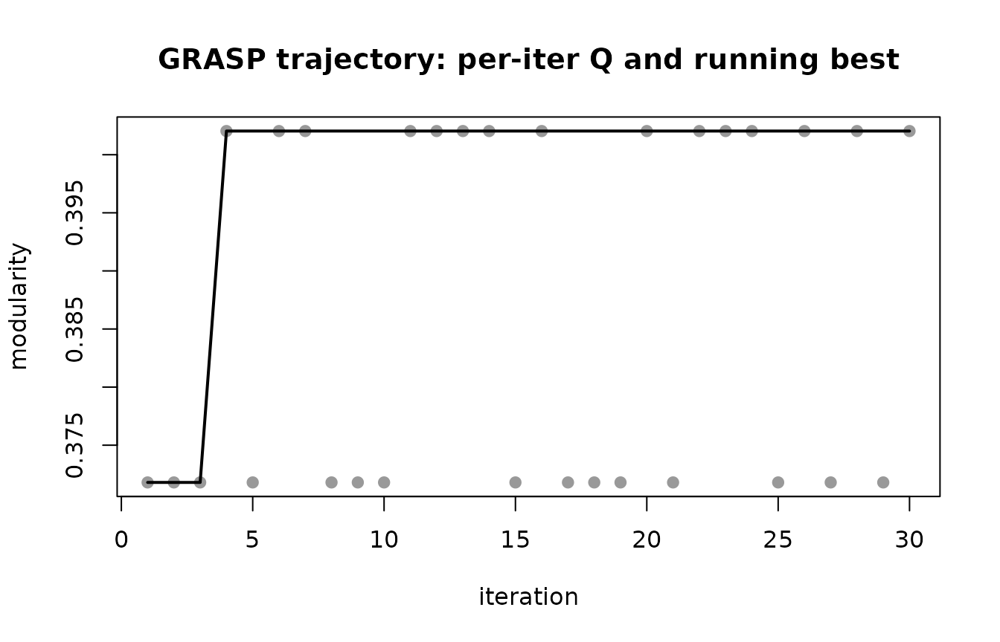
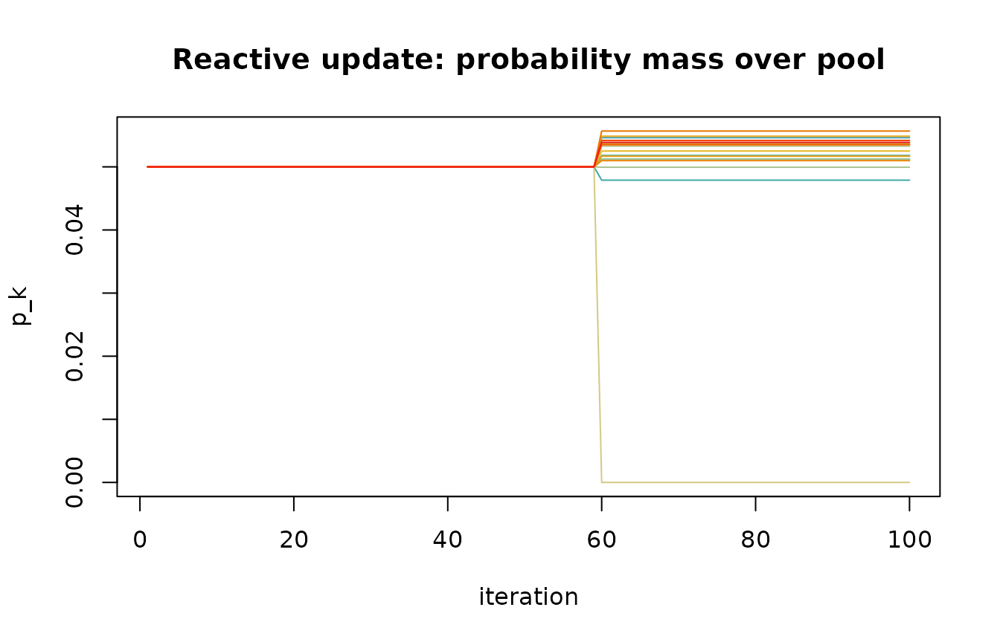

# Getting started with lcdaGRASP

## Overview

`lcdaGRASP` implements the four algorithms of Ospina, Silva, Matos
Junior, Leite and Ochi (2026) for **joint community-and-leader
detection**:

- [`lcda_grasp()`](https://castlaboratory.github.io/lcdaGRASP/reference/lcda_grasp.md)
  — fixed-parameter GRASP, variants 1 (static centrality) and 2
  (adaptive centrality recomputed each iteration).
- [`lcda_gr()`](https://castlaboratory.github.io/lcdaGRASP/reference/lcda_gr.md)
  — Reactive GRASP, variants 1 and 2, with a bivariate self-tuning
  mechanism over a pool of `(alpha_c, alpha_s)` pairs.

The performance-critical kernels (incremental modularity, community
affinities, similarity vectors, the VNMI multi-improvement extension,
and power-iteration eigenvector centrality) are implemented in C++ via
Rcpp. The package follows a tidyverse style: snake_case throughout,
`tibble` outputs where tabular, `cli` for logging, and a `verbose` flag
on every substantive function.

## Quick start

``` r

library(lcdaGRASP)
#> lcdaGRASP 0.3.0 - GRASP / Reactive-GRASP for joint community-leader detection.
#> Reference: Ospina et al. (2026), preprint. See `vignette('lcdaGRASP-intro')`.
library(igraph)
#> 
#> Attaching package: 'igraph'
#> The following objects are masked from 'package:stats':
#> 
#>     decompose, spectrum
#> The following object is masked from 'package:base':
#> 
#>     union

g <- make_graph("Zachary")           # 34-node karate club
res <- lcda_grasp(g,
                  alpha_c = 0.1, alpha_s = 0.3, B = 30,
                  centrality = "eigen", similarity = "hpi",
                  seed = 1)
print(res)
#> 
#> ── LCDA-GRASP result ───────────────────────────────────────────────────────────
#> variant: 1
#> B: 30
#> centrality / similarity: eigen / hpi
#> best Q: 0.402038
#> best H: 0.84
#> best iteration: 4
#> communities: 3
```

Set `verbose = TRUE` for a `cli` progress bar and a one-line summary:

``` r

invisible(lcda_grasp(g, B = 10, seed = 1, verbose = TRUE))
#> ✔ best Q = 0.402038 (H = 0.84) at iteration 4, 3 communities
```

## Inspecting the GRASP trajectory

``` r

plot_grasp_trajectory(res)
```



## Switching to the Reactive variant

``` r

res_r <- lcda_gr(g, variant = 1, B = 100, seed = 1)
print(res_r)
#> 
#> ── LCDA-GR (Reactive) result ───────────────────────────────────────────────────
#> variant: 1
#> B / m / y: 100 / 20 / 60
#> best Q: 0.41979
#> best H: 0.7377
#> best iter / pair: 5 / 17
#> H-decisive updates: 0 (0.0% of B)
plot_reactive_pk(res_r)
```



The print method reports the fraction of iterations in which the
lexicographic tie-break on `H` (Node-Connection Entropy) was decisive —
iterations where `Q` was tied with the running best and `H` made the
difference. In typical networks this fraction is small; see the
*Reactive convergence* and *Pool sensitivity* articles.

## Statistical comparison

The paper uses a Kruskal–Wallis omnibus test followed by pairwise
permutation tests with Bonferroni correction.
[`kruskal_then_permute()`](https://castlaboratory.github.io/lcdaGRASP/reference/kruskal_then_permute.md)
returns a tibble of pairwise contrasts and a compact-letter display:

``` r

set.seed(1)
df <- data.frame(
  Q = c(rnorm(20, 0.40, 0.01), rnorm(20, 0.42, 0.01), rnorm(20, 0.42, 0.01)),
  cfg = rep(c("a", "b", "c"), each = 20)
)
out <- kruskal_then_permute(df$Q, df$cfg, B_perm = 2000)
out$letters
#>   a   b   c 
#> "a" "b" "b"
```

## Community-conditioned NCE

The paper’s NCE uses the *global* connection probability `k_v / n`. The
package also exposes a community-conditioned alternative
[`nce_local_score()`](https://castlaboratory.github.io/lcdaGRASP/reference/nce_local_score.md)
measuring within-community connectivity entropy; the two can differ
materially (see the *Leader score* article).

``` r

H_global <- nce_score(g, res_r$best$leaders)
H_local  <- nce_local_score(g, res_r$best$membership, res_r$best$leaders)
cat("H (global, paper):", round(H_global, 4),
    " | H (community-conditioned):", round(H_local, 4), "\n")
#> H (global, paper): 0.7377  | H (community-conditioned): 0.4456
```

## Precomputed simulation datasets

The companion *Articles* render from precomputed results shipped under
`inst/extdata/`, so they never re-run a simulation. List them with:

``` r

lcda_data()
#> # A tibble: 24 × 1
#>    dataset              
#>    <chr>                
#>  1 blogs_table9         
#>  2 blogs_timing         
#>  3 consensus_leader_test
#>  4 degeneracy           
#>  5 doe_lfr_recovery     
#>  6 doe_rsm              
#>  7 doe_screening        
#>  8 eda_replicates       
#>  9 gnn_baseline         
#> 10 largescale           
#> # ℹ 14 more rows
```

## References

- Ospina, R., Silva, G., Matos Junior, F. J., Leite, A., & Ochi, L. S.
  (2026). *A GRASP Framework for Community and Leader Detection in
  Complex Networks.* Preprint submitted to *Knowledge-Based Systems*.
- Feo, T. A., & Resende, M. G. C. (1995). Greedy Randomized Adaptive
  Search Procedures. *Journal of Global Optimization*, 6(2), 109–133.
  [doi:10.1007/BF01096763](https://doi.org/10.1007/BF01096763)
- Prais, M., & Ribeiro, C. C. (2000). Reactive GRASP. *INFORMS Journal
  on Computing*, 12(3), 164–176.
  [doi:10.1287/ijoc.12.3.164.12639](https://doi.org/10.1287/ijoc.12.3.164.12639)
