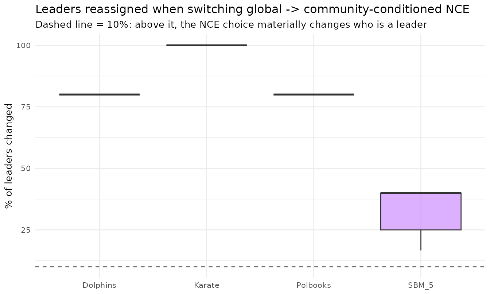

# The leader score: global vs community-conditioned NCE

## Is the NCE measuring the right thing?

The paper’s Node-Connection Entropy uses the **global** connection
probability $`p_1(v) = k_v / n`$. But a hub whose degree is spread
across *all* communities can maximise this score while being a poor
*community* leader. Since a score is a simplification, it is worth
checking what it actually rewards — which motivates a
**community-conditioned** alternative:

``` math
 I_{\text{local}}(v) = H_b\!\left(\frac{|\Gamma(v) \cap C(v)|}{|C(v)| - 1}\right), 
```

exposed in the package as
[`nce_local_score()`](https://castlaboratory.github.io/lcdaGRASP/reference/nce_local_score.md).
We measure how often the designated leader **changes** when re-picked
under the local score.

``` r

d$results |>
  dplyr::group_by(graph) |>
  dplyr::summarise(
    communities       = round(mean(n_communities), 1),
    H_global          = round(mean(H_paper_global), 3),
    H_local           = round(mean(H_paper_local), 3),
    pct_leaders_changed = round(mean(pct_leaders_changed), 1),
    .groups = "drop") |>
  knitr::kable(caption = "Mean leader-score values and the fraction of leaders that change identity under the local NCE.")
```

| graph    | communities | H_global | H_local | pct_leaders_changed |
|:---------|------------:|---------:|--------:|--------------------:|
| Dolphins |         5.0 |    0.581 |   0.741 |                80.0 |
| Karate   |         3.0 |    0.840 |   0.598 |               100.0 |
| Polbooks |         5.0 |    0.535 |   0.736 |                80.0 |
| SBM_5    |         5.1 |    0.343 |   0.764 |                33.7 |

Mean leader-score values and the fraction of leaders that change
identity under the local NCE. {.table}

``` r

library(ggplot2)
ggplot(d$results, aes(graph, pct_leaders_changed, fill = graph)) +
  geom_boxplot(alpha = 0.6, show.legend = FALSE) +
  geom_hline(yintercept = 10, linetype = 2, colour = "grey40") +
  labs(title = "Leaders reassigned when switching global -> community-conditioned NCE",
       subtitle = "Dashed line = 10%: above it, the NCE choice materially changes who is a leader",
       x = NULL, y = "% of leaders changed") +
  theme_minimal(base_size = 10)
```



**Reading.** If the change fraction is non-trivial (above ~10%), the
choice of NCE definition is *not* an interpretive detail — it materially
decides who is crowned the leader. Both scores are exported
([`nce_score()`](https://castlaboratory.github.io/lcdaGRASP/reference/nce_score.md)
and
[`nce_local_score()`](https://castlaboratory.github.io/lcdaGRASP/reference/nce_local_score.md))
precisely so this comparison is part of the contribution rather than
buried.

## Reproducibility and data provenance

The comparison above is read from a dataset shipped with the package;
nothing is re-run at build time. Each dataset records the package
version that **generated** it (not necessarily the version you
installed: the generators are re-run only when the algorithms change),
the release it first shipped in, and a SHA-256 checksum matching
`inst/extdata/SHA256SUMS`:

``` r

lcda_provenance("nce_alternatives")
#>            dataset generated_by generated_on first_release shipped_in
#> 1 nce_alternatives        0.3.1   2026-05-31         0.3.1      0.3.2
#>                                                             sha256
#> 1 4c84047682a77fd82555cc1b791668406d186afdecfa3ef453e3c2379c878d09
```

Regenerate with `data-raw/80_nce.R` (single documented seed).

**Honest reading.** The global-vs-community-conditioned NCE comparison
is a *structural* contrast of two exported scores, not a
downstream-utility claim; relatedly, the lexicographic $`H`$ tie-break
is empirically never decisive (it fired in $`0\%`$ of iterations across
the pool-sensitivity sweep), so $`H`$ acts as a tie-breaking safeguard
rather than a search driver.

## References

- Ospina, R., Silva, G., Matos Junior, F. J., Leite, A., & Ochi, L. S.
  (2026). *A GRASP Framework for Community and Leader Detection in
  Complex Networks.* Preprint.
- Akachar, E., Bougteb, Y., Ouhbi, B., & Frikh, B. (2025). LeaDCD:
  Leadership concept-based method for community detection. *Information
  Sciences*, 686, 121341.
  [doi:10.1016/j.ins.2024.121341](https://doi.org/10.1016/j.ins.2024.121341)
