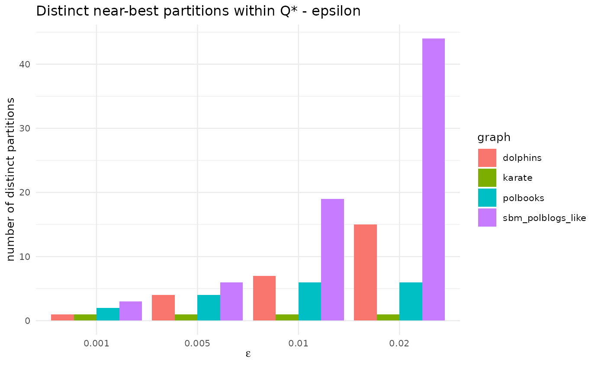

# Modularity degeneracy (Box)

## Every model is a simplification

Box’s lens: modularity is an approximation, and one of its known
pathologies is *degeneracy* — many structurally distinct partitions can
have $`Q`$ within $`\varepsilon`$ of the maximum \[Good, de Montjoye &
Clauset, 2010\]. For a multi-start metaheuristic this is double-edged:
lots of optima to find, but the single partition you report (and
therefore the leaders you name) is somewhat arbitrary. We audit how many
**distinct near-best partitions** LCDA-GRASP finds and their mean
pairwise NMI (low NMI = high degeneracy).

``` r

knitr::kable(
  dplyr::transmute(d$results, graph, epsilon,
                   Q_star = round(Q_star, 4),
                   runs_in_band = n_runs_in_band,
                   distinct_partitions = n_distinct_partitions,
                   mean_NMI = round(mean_pairwise_NMI, 3)),
  caption = "Distinct near-best partitions and their similarity, per network and tolerance.")
```

| graph             | epsilon | Q_star | runs_in_band | distinct_partitions | mean_NMI |
|:------------------|--------:|-------:|-------------:|--------------------:|---------:|
| karate            |   0.001 | 0.4020 |           33 |                   1 |    1.000 |
| karate            |   0.005 | 0.4020 |           33 |                   1 |    1.000 |
| karate            |   0.010 | 0.4020 |           33 |                   1 |    1.000 |
| karate            |   0.020 | 0.4020 |           33 |                   1 |    1.000 |
| dolphins          |   0.001 | 0.5259 |            4 |                   1 |    1.000 |
| dolphins          |   0.005 | 0.5259 |           12 |                   4 |    0.845 |
| dolphins          |   0.010 | 0.5259 |           28 |                   7 |    0.821 |
| dolphins          |   0.020 | 0.5259 |           59 |                  15 |    0.798 |
| polbooks          |   0.001 | 0.5272 |           44 |                   2 |    0.980 |
| polbooks          |   0.005 | 0.5272 |           48 |                   4 |    0.967 |
| polbooks          |   0.010 | 0.5272 |           60 |                   6 |    0.931 |
| polbooks          |   0.020 | 0.5272 |           60 |                   6 |    0.931 |
| sbm_polblogs_like |   0.001 | 0.2093 |            3 |                   3 |    0.339 |
| sbm_polblogs_like |   0.005 | 0.2093 |            6 |                   6 |    0.349 |
| sbm_polblogs_like |   0.010 | 0.2093 |           19 |                  19 |    0.347 |
| sbm_polblogs_like |   0.020 | 0.2093 |           44 |                  44 |    0.341 |

Distinct near-best partitions and their similarity, per network and
tolerance. {.table style="width:100%;"}

``` r

library(ggplot2)
ggplot(d$results, aes(factor(epsilon), n_distinct_partitions, fill = graph)) +
  geom_col(position = "dodge") +
  labs(title = "Distinct near-best partitions within Q* - epsilon",
       x = expression(epsilon), y = "number of distinct partitions") +
  theme_minimal(base_size = 10)
```



**Reading.** Even at small $`\varepsilon`$, several distinct partitions
coexist in the top band on the larger/diffuse networks, and the mean
pairwise NMI sits below 1 — so the reported leader-community
configuration is *one of several* near-equivalent ones. This does not
invalidate the method, but it bounds the interpretability claim about
“named leaders”: the names can shift across seeds. The paper
acknowledges the resolution limit but not this degeneracy; it is now
flagged in the manuscript’s Limitations (see `artigo/CHANGES.md`).

## References

- Good, B. H., de Montjoye, Y.-A., & Clauset, A. (2010). Performance of
  modularity maximization in practical contexts. *Phys. Rev. E*,
  81, 046106.
  [doi:10.1103/PhysRevE.81.046106](https://doi.org/10.1103/PhysRevE.81.046106)
