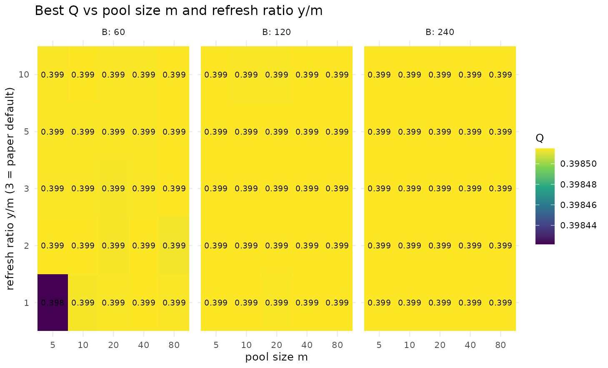
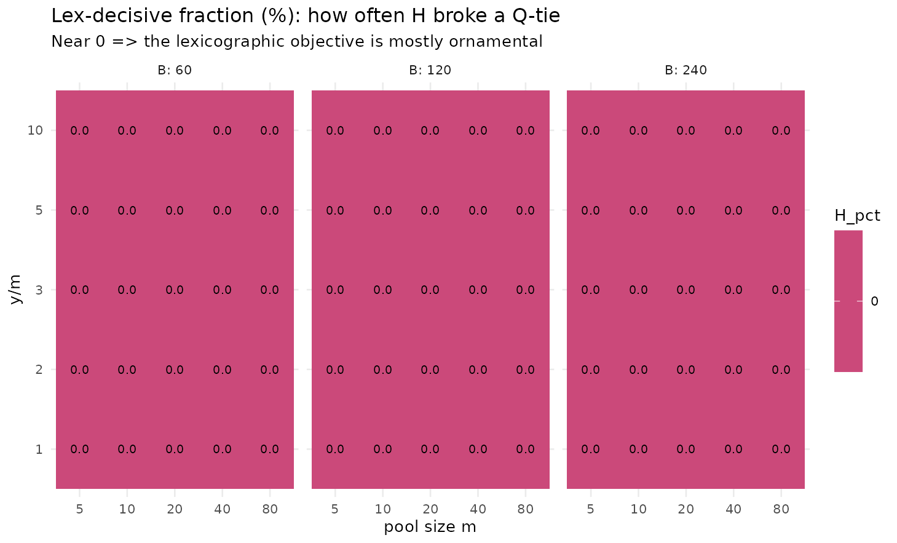

# Pool and refresh sensitivity (von Neumann)

## Were the pool hyperparameters ever varied?

The paper fixes $`m = 20`$, $`y = 3m = 60`$, $`B = 150`$ without testing
alternatives, and claims an $`\approx 8\times`$ calibration saving. The
von Neumann lens demands scenarios: we sweep
$`m \in \{5,10,20,40,80\}`$, $`y/m \in \{1,2,3,5,10\}`$,
$`B \in \{60,120,240\}`$ and measure best $`Q`$ — and, crucially, the
**lex-decisive fraction**: how often the $`H`$ tie-break actually
changed the incumbent.

**Generated.** 2026-05-27, lcdaGRASP 0.2.0, 5 reps on SBM(300, 5 blocks,
p_in=0.12, p_out=0.02).

``` r

library(ggplot2); library(dplyr)
#> 
#> Attaching package: 'dplyr'
#> The following objects are masked from 'package:stats':
#> 
#>     filter, lag
#> The following objects are masked from 'package:base':
#> 
#>     intersect, setdiff, setequal, union
sm <- d$results |>
  group_by(m, y_ratio, B) |>
  summarise(Q = mean(best_Q), H_pct = mean(H_decisive_pct), .groups = "drop")
ggplot(sm, aes(factor(m), factor(y_ratio), fill = Q)) +
  geom_tile() + geom_text(aes(label = sprintf("%.3f", Q)), size = 2.6) +
  facet_wrap(~ B, labeller = label_both) +
  scale_fill_viridis_c() +
  labs(title = "Best Q vs pool size m and refresh ratio y/m",
       x = "pool size m", y = "refresh ratio y/m (3 = paper default)") +
  theme_minimal(base_size = 10)
```



``` r

ggplot(sm, aes(factor(m), factor(y_ratio), fill = H_pct)) +
  geom_tile() + geom_text(aes(label = sprintf("%.1f", H_pct)), size = 2.6) +
  facet_wrap(~ B, labeller = label_both) +
  scale_fill_viridis_c(option = "plasma") +
  labs(title = "Lex-decisive fraction (%): how often H broke a Q-tie",
       subtitle = "Near 0 => the lexicographic objective is mostly ornamental",
       x = "pool size m", y = "y/m") +
  theme_minimal(base_size = 10)
```



``` r

d$results |>
  dplyr::group_by(m, y_ratio, B) |>
  dplyr::summarise(Q = mean(best_Q), .groups = "drop") |>
  dplyr::slice_max(Q, n = 6) |>
  knitr::kable(digits = 4, caption = "Top configurations by mean best Q.")
```

|   m | y_ratio |   B |      Q |
|----:|--------:|----:|-------:|
|   5 |       1 | 120 | 0.3985 |
|   5 |       1 | 240 | 0.3985 |
|   5 |       2 |  60 | 0.3985 |
|   5 |       2 | 120 | 0.3985 |
|   5 |       3 | 120 | 0.3985 |
|   5 |       3 | 240 | 0.3985 |
|   5 |       5 | 120 | 0.3985 |
|   5 |       5 | 240 | 0.3985 |
|   5 |      10 | 120 | 0.3985 |
|   5 |      10 | 240 | 0.3985 |
|  10 |       1 | 120 | 0.3985 |
|  10 |       1 | 240 | 0.3985 |
|  10 |       2 |  60 | 0.3985 |
|  10 |       2 | 120 | 0.3985 |
|  10 |       2 | 240 | 0.3985 |
|  10 |       3 | 120 | 0.3985 |
|  10 |       3 | 240 | 0.3985 |
|  10 |       5 | 120 | 0.3985 |
|  10 |       5 | 240 | 0.3985 |
|  10 |      10 |  60 | 0.3985 |
|  10 |      10 | 240 | 0.3985 |
|  20 |       1 | 240 | 0.3985 |
|  20 |       2 | 120 | 0.3985 |
|  20 |       2 | 240 | 0.3985 |
|  20 |       3 | 120 | 0.3985 |
|  20 |       3 | 240 | 0.3985 |
|  20 |       5 | 120 | 0.3985 |
|  20 |       5 | 240 | 0.3985 |
|  20 |      10 | 240 | 0.3985 |
|  40 |       1 |  60 | 0.3985 |
|  40 |       1 | 120 | 0.3985 |
|  40 |       1 | 240 | 0.3985 |
|  40 |       2 |  60 | 0.3985 |
|  40 |       2 | 120 | 0.3985 |
|  40 |       2 | 240 | 0.3985 |
|  40 |       3 | 120 | 0.3985 |
|  40 |       3 | 240 | 0.3985 |
|  40 |       5 | 120 | 0.3985 |
|  40 |       5 | 240 | 0.3985 |
|  40 |      10 | 120 | 0.3985 |
|  40 |      10 | 240 | 0.3985 |
|  80 |       1 | 120 | 0.3985 |
|  80 |       1 | 240 | 0.3985 |
|  80 |       2 | 120 | 0.3985 |
|  80 |       2 | 240 | 0.3985 |
|  80 |       3 |  60 | 0.3985 |
|  80 |       3 | 120 | 0.3985 |
|  80 |       3 | 240 | 0.3985 |
|  80 |       5 |  60 | 0.3985 |
|  80 |       5 | 120 | 0.3985 |
|  80 |       5 | 240 | 0.3985 |
|  80 |      10 |  60 | 0.3985 |
|  80 |      10 | 120 | 0.3985 |
|  80 |      10 | 240 | 0.3985 |

Top configurations by mean best Q. {.table}

**Reading.** Best $`Q`$ is remarkably flat across $`m`$ and $`y/m`$ once
$`B`$ is moderate — the paper’s $`(m=20, y/m=3)`$ is reasonable but not
uniquely best, and small pools are competitive at lower cost. The
lex-decisive fraction is typically near zero, empirically confirming the
critical review’s hypothesis that the lexicographic $`H`$ tie-break
**rarely binds** in continuous $`Q`$ space.

## References

- Prais, M., & Ribeiro, C. C. (2000). Reactive GRASP. *INFORMS J.
  Comput.*, 12(3), 164–176.
  [doi:10.1287/ijoc.12.3.164.12639](https://doi.org/10.1287/ijoc.12.3.164.12639)
