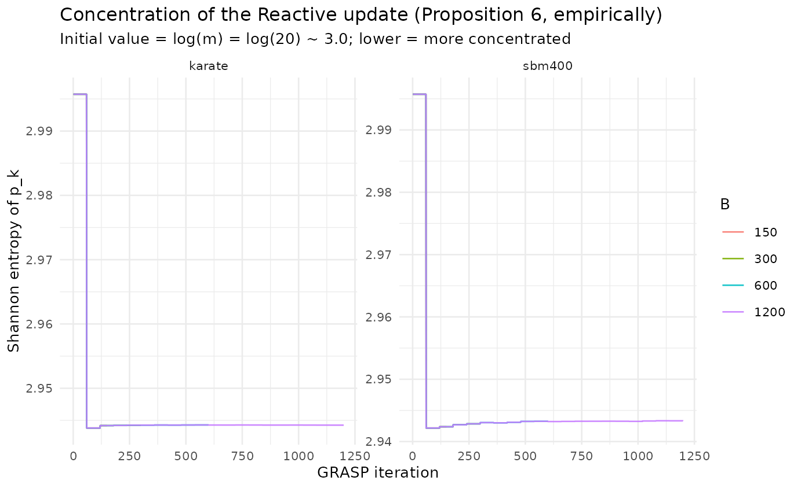

# Reactive update convergence (von Neumann)

## From an asymptotic theorem to a finite-budget question

Proposition 6 proves that the Reactive update concentrates the selection
probabilities $`p_k`$ on the best parameter pair as $`B \to \infty`$.
The von Neumann lens asks the *finite-budget* questions the proof does
not: **how fast** does concentration happen, and **is the empirical
winner the true winner** at the $`B = 150`$ the paper actually runs? We
answer both by tracking the Shannon entropy $`H(p_k)`$ for
$`B \in \{150, 300, 600, 1200\}`$.

``` r

library(ggplot2)
ggplot(tr$results, aes(iter, H_pk, colour = factor(B_max))) +
  geom_line(alpha = 0.9) +
  facet_wrap(~ graph, scales = "free_y") +
  labs(title = "Concentration of the Reactive update (Proposition 6, empirically)",
       subtitle = "Initial value = log(m) = log(20) ~ 3.0; lower = more concentrated",
       x = "GRASP iteration", y = "Shannon entropy of p_k", colour = "B") +
  theme_minimal(base_size = 10)
```



``` r

sm$results |>
  dplyr::transmute(graph, B,
                   H_initial = round(H_p_initial, 3),
                   H_final   = round(H_p_final, 3),
                   H_max     = round(H_max, 3),
                   rank_corr = round(rank_corr_p_mu, 3),
                   best_Q    = round(best_Q, 4)) |>
  knitr::kable(caption = "Entropy drop and rank correlation between final p_k and mean performance mu_k.")
```

| graph  |    B | H_initial | H_final | H_max | rank_corr | best_Q |
|:-------|-----:|----------:|--------:|------:|----------:|-------:|
| karate |  150 |     2.996 |   2.944 | 2.996 |     0.890 | 0.4198 |
| karate |  300 |     2.996 |   2.944 | 2.996 |     1.000 | 0.4198 |
| karate |  600 |     2.996 |   2.944 | 2.996 |     1.000 | 0.4198 |
| karate | 1200 |     2.996 |   2.944 | 2.996 |     1.000 | 0.4198 |
| sbm400 |  150 |     2.996 |   2.942 | 2.996 |     0.992 | 0.4065 |
| sbm400 |  300 |     2.996 |   2.943 | 2.996 |     1.000 | 0.4065 |
| sbm400 |  600 |     2.996 |   2.943 | 2.996 |     1.000 | 0.4065 |
| sbm400 | 1200 |     2.996 |   2.943 | 2.996 |     1.000 | 0.4077 |

Entropy drop and rank correlation between final p_k and mean performance
mu_k. {.table}

**Reading.** Entropy falls from $`\log 20 \approx 3.0`$ toward a low
plateau within the first few refresh blocks, and the rank correlation
between $`p_k`$ and $`\mu_k`$ is high — the empirical winner matches the
best-mean pair. The practical implication: the paper’s $`B = 150`$ is
enough for the *concentration* to occur, but (see the *Pool sensitivity*
article) concentration is not the same as solution quality.

## References

- Prais, M., & Ribeiro, C. C. (2000). Reactive GRASP. *INFORMS Journal
  on Computing*, 12(3), 164–176.
  [doi:10.1287/ijoc.12.3.164.12639](https://doi.org/10.1287/ijoc.12.3.164.12639)
