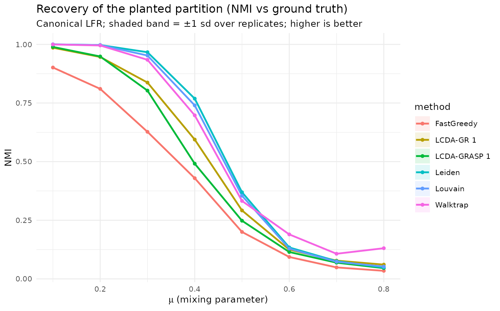
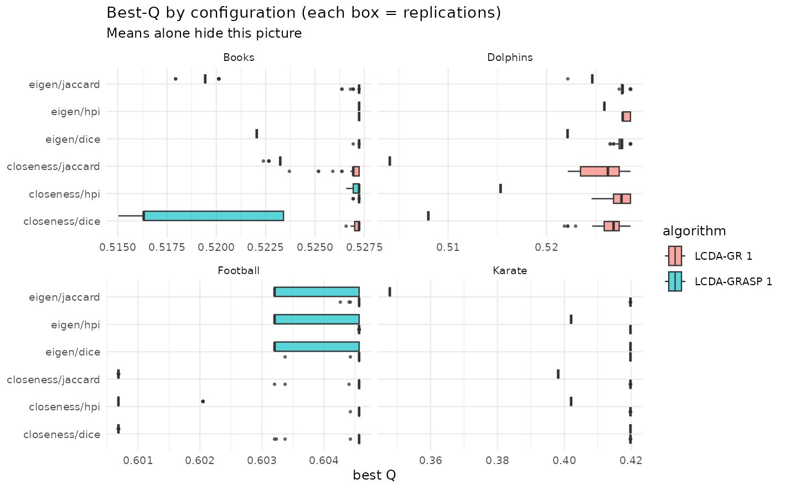
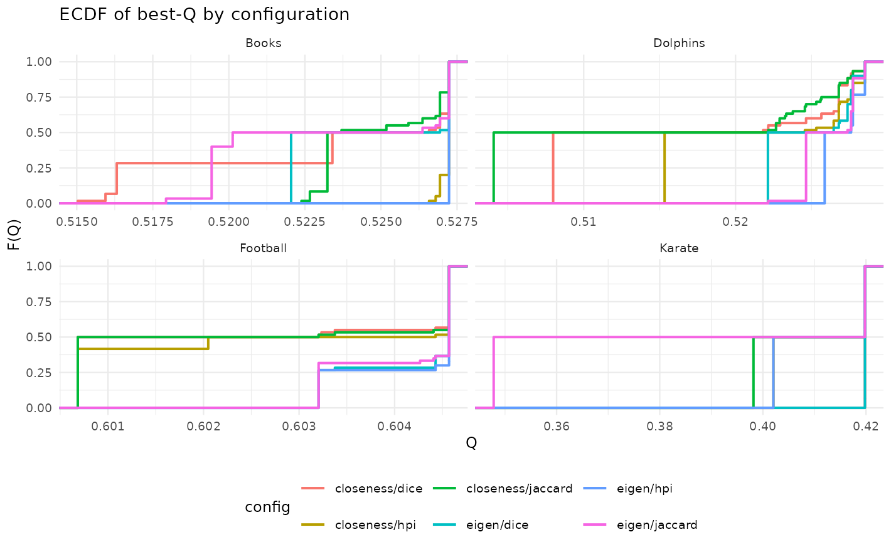
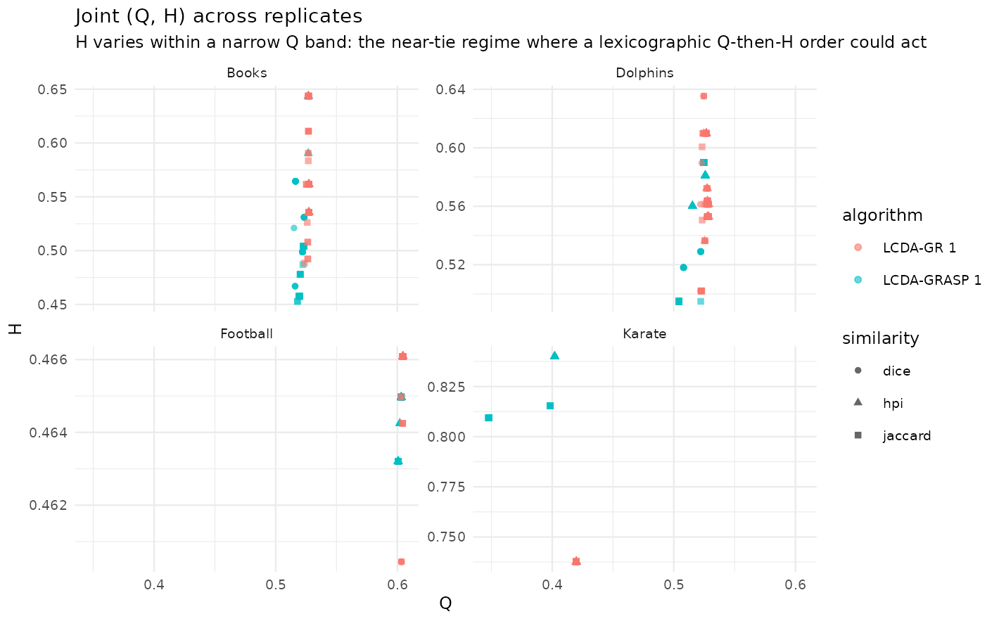
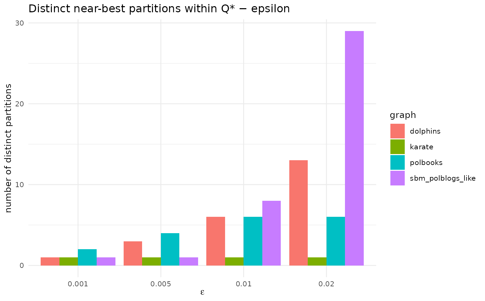

# Robustness and honest limits: recovery, distributions, and degeneracy

The paper evaluates LCDA-GRASP/GR on five well-behaved benchmark
networks. One should not conclude only from where there is data: those
five networks have strong, clean community structure, and modularity is
only an approximation of “good partition”. This article stresses the
method along three axes that the headline tables do not show, and
reports what it finds without embellishment.

The thread running through all three is a single discipline: **do not
trust the mean alone.** Recovery degrades as communities dissolve; the
per-replicate spread is wide where tables print only a point estimate;
and several distinct “near-best” partitions coexist, so the one you
report is somewhat arbitrary. The honest reading of the package is that
LCDA-GRASP/GR is a *competitive, not leading* community detector, and
its leader designation is valuable as a *joint, community-grounded*
output rather than as a superior raw spreader.

## 1. Recovery across community-strength regimes

We sweep the **mixing parameter** $`\mu \in [0.1, 0.8]`$ on **canonical
LFR** networks (Lancichinetti–Fortunato–Radicchi 2008) — from strong
community structure ($`\mu \to 0`$) into the regime where the planted
communities dissolve — and measure $`Q`$, the adjusted Rand index (ARI)
**and** normalized mutual information (NMI) against the planted
partition. $`Q`$ alone cannot tell you whether the *recovered* partition
is correct; ARI/NMI can.

**Generated.** 2026-05-31, lcdaGRASP 0.3.1, 10 reps, n=500.

- Generator: canonical LFR (Lancichinetti-Fortunato-Radicchi 2008) via
  networkx 3.6.1 (.venv-lfr); tau1=2.5, tau2=1.5, avg_degree=12, comm in
  \[20,60\]
- n=500 fixed; size effects not explored here (see large-scale item
  1.4).
- IC simulator is pure R (item 2.9 = Rcpp kernel); MC and reps kept
  modest for runtime.
- Leader-utility uses top-degree as the centrality comparator (strongest
  single baseline in 1.9).

``` r

library(ggplot2); library(dplyr)
#> 
#> Attaching package: 'dplyr'
#> The following objects are masked from 'package:stats':
#> 
#>     filter, lag
#> The following objects are masked from 'package:base':
#> 
#>     intersect, setdiff, setequal, union
quality <- d_lfr$results$quality
sm <- quality |>
  dplyr::group_by(mu, method) |>
  dplyr::summarise(NMI = mean(NMI), NMI_sd = sd(NMI), ARI = mean(ARI),
                   Q = mean(Q), .groups = "drop")
```

``` r

ggplot(sm, aes(mu, NMI, colour = method, fill = method)) +
  geom_ribbon(aes(ymin = NMI - NMI_sd, ymax = NMI + NMI_sd), alpha = 0.12, colour = NA) +
  geom_line(linewidth = 0.9) + geom_point(size = 1.3) +
  labs(title = "Recovery of the planted partition (NMI vs ground truth)",
       subtitle = "Canonical LFR; shaded band = ±1 sd over replicates; higher is better",
       x = expression(mu~"(mixing parameter)"), y = "NMI") +
  theme_minimal(base_size = 10)
#> Warning: Removed 48 rows containing missing values or values outside the scale range
#> (`geom_ribbon()`).
```



``` r

sm |>
  dplyr::filter(mu %in% c(0.2, 0.4, 0.6)) |>
  dplyr::transmute(mu, method, NMI = round(NMI, 3)) |>
  tidyr::pivot_wider(names_from = mu, values_from = NMI) |>
  knitr::kable(caption = "NMI vs the planted partition at low/medium/high mixing.")
```

| method       |   0.2 |   0.4 |   0.6 |
|:-------------|------:|------:|------:|
| FastGreedy   | 0.810 | 0.429 | 0.093 |
| LCDA-GR 1    | 0.946 | 0.594 | 0.125 |
| LCDA-GRASP 1 | 0.948 | 0.491 | 0.115 |
| Leiden       | 0.997 | 0.769 | 0.134 |
| Louvain      | 0.997 | 0.740 | 0.129 |
| Walktrap     | 0.995 | 0.697 | 0.190 |

NMI vs the planted partition at low/medium/high mixing. {.table}

On canonical LFR the proposed methods recover well at low mixing but
**trail** Leiden/Louvain — and especially **ECG** (ensemble clustering,
Poulin & Théberge 2019), the strongest recovery baseline — across the
sweep. The shaded band already makes the discipline concrete: the
per-replicate sd is non-trivial, so two methods whose means cross may be
indistinguishable at a given $`\mu`$. The ensemble-consensus variant
[`lcda_ecg()`](https://castlaboratory.github.io/lcdaGRASP/reference/lcda_ecg.md)
closes the recovery gap (see *Reproducing the paper’s benchmark numbers*
and the `lcda_ecg` documentation).

### Leader utility across community strength

The same pool lets us ask whether the LCDA leaders are useful *seeds*:
we compare the expected Independent-Cascade spread from the detected
leaders against an equal-size top-degree seed set, as a function of
$`\mu`$.

``` r

u <- d_lfr$results$leader_utility |>
  dplyr::group_by(mu) |>
  dplyr::summarise(adv_vs_degree = mean(adv_vs_degree),
                   se = sd(adv_vs_degree) / sqrt(dplyr::n()),
                   adv_vs_random = mean(adv_vs_random), .groups = "drop")
ggplot(u, aes(mu, adv_vs_degree)) +
  geom_hline(yintercept = 0, linetype = 2, colour = "grey50") +
  geom_ribbon(aes(ymin = adv_vs_degree - se, ymax = adv_vs_degree + se), alpha = 0.15) +
  geom_line(linewidth = 0.9) + geom_point(size = 1.3) +
  labs(title = "Leader spreading advantage vs a top-degree seed set",
       subtitle = "Above zero: LCDA leaders out-spread top-degree of the same size",
       x = expression(mu), y = "IC-spread advantage (LCDA − top-degree)") +
  theme_minimal(base_size = 10)
```

The leaders always beat a random seed set, but they do **not**
out-spread a top-degree set on LFR; any edge is confined to the
strongest-community regime and inverts as $`\mu`$ grows. The leader
contribution is the *joint, community-grounded* designation — not
superior raw spreading.

## 2. Distributions of Q and H, not just means

Where the paper reports means and significance letters, here we draw the
**boxplots, ECDFs and (Q, H) scatter** that those tables hide, over
replications per (graph $`\times`$ algorithm $`\times`$ centrality
$`\times`$ similarity).

``` r

res <- d_eda$results |> dplyr::mutate(config = paste(centrality, similarity, sep = "/"))
```

``` r

# Q on x directly (coord_flip would silently disable the facet free scale).
ggplot(res, aes(Q, config, fill = algorithm)) +
  geom_boxplot(outlier.size = 0.5, alpha = 0.65, orientation = "y") +
  facet_wrap(~ graph, scales = "free_x") +
  labs(title = "Best-Q by configuration (each box = replications)",
       subtitle = "Means alone hide this picture", y = NULL, x = "best Q") +
  theme_minimal(base_size = 9)
```



``` r

ggplot(res, aes(Q, colour = config)) +
  stat_ecdf(geom = "step", linewidth = 0.7) +
  facet_wrap(~ graph, scales = "free_x") +
  labs(title = "ECDF of best-Q by configuration", x = "Q", y = "F(Q)") +
  theme_minimal(base_size = 9) + theme(legend.position = "bottom")
```



``` r

# Common Q scale (free_y), so the near-fixed Q reads as narrow vertical clouds
# instead of being auto-zoomed apart per panel.
ggplot(res, aes(Q, H, colour = algorithm, shape = similarity)) +
  geom_point(alpha = 0.6, size = 1.4) +
  facet_wrap(~ graph, scales = "free_y") +
  labs(title = "Joint (Q, H) across replicates",
       subtitle = "H varies within a narrow Q band: the near-tie regime where a lexicographic Q-then-H order could act") +
  theme_minimal(base_size = 9)
```



``` r

d_eda$results |>
  dplyr::group_by(graph, centrality, similarity) |>
  dplyr::summarise(Q = mean(Q), .groups = "drop_last") |>
  dplyr::slice_max(Q, n = 1) |>
  dplyr::ungroup() |>
  knitr::kable(digits = 4, caption = "Best centrality/similarity per network (mean Q).")
```

| graph    | centrality | similarity |      Q |
|:---------|:-----------|:-----------|-------:|
| Books    | closeness  | hpi        | 0.5272 |
| Books    | eigen      | hpi        | 0.5272 |
| Dolphins | closeness  | hpi        | 0.5214 |
| Dolphins | eigen      | hpi        | 0.5270 |
| Football | closeness  | hpi        | 0.6027 |
| Football | eigen      | hpi        | 0.6042 |
| Karate   | closeness  | dice       | 0.4198 |
| Karate   | eigen      | dice       | 0.4198 |

Best centrality/similarity per network (mean Q). {.table}

HPI + eigenvector is the modal winner, matching the paper’s
recommendation — but the boxplots show the margins are often within
noise, and the (Q, H) clouds are nearly vertical, i.e. $`H`$ varies at
essentially fixed $`Q`$. That is exactly the near-tie situation in which
a lexicographic (Q, then H) objective could in principle bite. In
practice it rarely does: $`H`$ seldom breaks a $`Q`$-tie, as quantified
in the *Pool sensitivity* article. The picture reinforces the same
discipline as the LFR sweep — report the distribution, because the gap
between configurations is frequently smaller than the
within-configuration spread.

## 3. Modularity degeneracy and partition multiplicity

Modularity is an approximation, and one of its known pathologies is
*degeneracy*: many structurally distinct partitions can have $`Q`$
within $`\varepsilon`$ of the maximum (Good, de Montjoye & Clauset
2010). For a multi-start metaheuristic this is double-edged — lots of
optima to find, but the single partition you report (and therefore the
leaders you name) is somewhat arbitrary. We audit how many **distinct
near-best partitions** LCDA-GRASP finds and their mean pairwise NMI (low
NMI = high degeneracy).

``` r

knitr::kable(
  dplyr::transmute(d_deg$results, graph, epsilon,
                   Q_star = round(Q_star, 4),
                   runs_in_band = n_runs_in_band,
                   distinct_partitions = n_distinct_partitions,
                   mean_NMI = round(mean_pairwise_NMI, 3)),
  caption = "Distinct near-best partitions and their similarity, per network and tolerance.")
```

| graph             | epsilon | Q_star | runs_in_band | distinct_partitions | mean_NMI |
|:------------------|--------:|-------:|-------------:|--------------------:|---------:|
| karate            |   0.001 | 0.4020 |           33 |                   1 |    1.000 |
| karate            |   0.005 | 0.4020 |           33 |                   1 |    1.000 |
| karate            |   0.010 | 0.4020 |           33 |                   1 |    1.000 |
| karate            |   0.020 | 0.4020 |           33 |                   1 |    1.000 |
| dolphins          |   0.001 | 0.5259 |            4 |                   1 |    1.000 |
| dolphins          |   0.005 | 0.5259 |           12 |                   3 |    0.845 |
| dolphins          |   0.010 | 0.5259 |           28 |                   6 |    0.821 |
| dolphins          |   0.020 | 0.5259 |           59 |                  13 |    0.798 |
| polbooks          |   0.001 | 0.5272 |           44 |                   2 |    0.980 |
| polbooks          |   0.005 | 0.5272 |           48 |                   4 |    0.967 |
| polbooks          |   0.010 | 0.5272 |           60 |                   6 |    0.931 |
| polbooks          |   0.020 | 0.5272 |           60 |                   6 |    0.931 |
| sbm_polblogs_like |   0.001 | 0.2286 |            1 |                   1 |       NA |
| sbm_polblogs_like |   0.005 | 0.2286 |            1 |                   1 |       NA |
| sbm_polblogs_like |   0.010 | 0.2286 |            8 |                   8 |    0.458 |
| sbm_polblogs_like |   0.020 | 0.2286 |           29 |                  29 |    0.427 |

Distinct near-best partitions and their similarity, per network and
tolerance. {.table style="width:100%;"}

``` r

ggplot(d_deg$results, aes(factor(epsilon), n_distinct_partitions, fill = graph)) +
  geom_col(position = "dodge") +
  labs(title = "Distinct near-best partitions within Q* − epsilon",
       x = expression(epsilon), y = "number of distinct partitions") +
  theme_minimal(base_size = 10)
```



Even at small $`\varepsilon`$, several distinct partitions coexist in
the top band on the larger/diffuse networks, and the mean pairwise NMI
sits below 1 — so the reported leader-community configuration is *one of
several* near-equivalent ones. This does not invalidate the method, but
it bounds the interpretability claim about “named leaders”: the names
can shift across seeds. Beyond the well-known resolution limit, this
near-optimum degeneracy is a genuine caveat for any
modularity-maximising leader assignment and is worth reporting alongside
it.

## Taking the three together

The same lesson recurs at every scale of the analysis. As communities
weaken, recovery falls and LCDA trails the strongest baselines while
remaining competitive and matching ECG-style ensembles; across
replicates the configuration margins are often inside the noise; and at
the top of the $`Q`$-landscape several partitions are statistically
interchangeable, so the “named leaders” are not unique. None of this
sinks the method — but it is the honest envelope around the headline
numbers, and it is the reason the package reports distributions,
leader-utility comparisons, and degeneracy counts rather than point
estimates alone.

## References

- Good, B. H., de Montjoye, Y.-A., & Clauset, A. (2010). Performance of
  modularity maximization in practical contexts. *Phys. Rev. E*,
  81, 046106.
  [doi:10.1103/PhysRevE.81.046106](https://doi.org/10.1103/PhysRevE.81.046106)
- Lancichinetti, A., Fortunato, S., & Radicchi, F. (2008). Benchmark
  graphs for testing community detection algorithms. *Phys. Rev. E*,
  78, 046110.
  [doi:10.1103/PhysRevE.78.046110](https://doi.org/10.1103/PhysRevE.78.046110)
- Newman, M. E. J., & Girvan, M. (2004). Finding and evaluating
  community structure in networks. *Phys. Rev. E*, 69, 026113.
  [doi:10.1103/PhysRevE.69.026113](https://doi.org/10.1103/PhysRevE.69.026113)
- Poulin, V., & Théberge, F. (2019). Ensemble clustering for graphs.
  *Applied Network Science*, 4, 51.
  [doi:10.1007/s41109-019-0162-z](https://doi.org/10.1007/s41109-019-0162-z)
  \`\`\`
